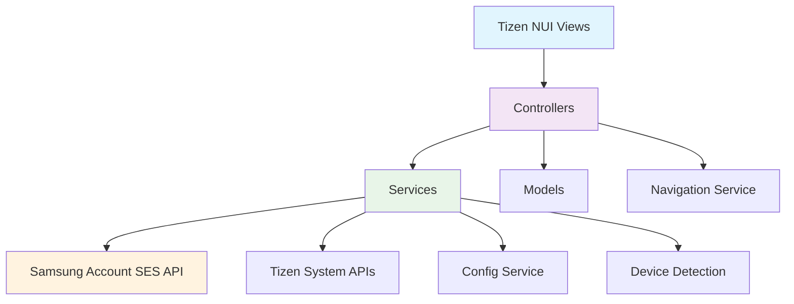

# Samsung Account UI Application - Developer Documentation

## 📋 Overview

This documentation provides comprehensive guidance for developing the Samsung Account UI application into a full-scale production system. The application is a Tizen C# NUI-based authentication system supporting Samsung FamilyHub refrigerators and AIHome appliances.

## 🏗️ Architecture Overview

The application follows a clean MVC (Model-View-Controller) architecture pattern with the following key characteristics:

- **Platform**: Tizen OS with C# NUI Framework
- **Architecture**: MVC Pattern with Service Layer
- **Target Devices**: FamilyHub (21"/32" vertical) and AIHome (7"/9" horizontal)
- **Authentication**: Multi-modal (QR, Password, Google OAuth)
- **Multi-User Support**: Up to 6 concurrent users

## 📚 Documentation Structure

### 🎯 Core Documentation
- [**Architecture Guide**](./architecture/README.md) - System architecture, class diagrams, and component relationships
- [**API Documentation**](./api/README.md) - Service interfaces, methods, and data contracts
- [**Integration Guide**](./integration/README.md) - Samsung Account SES API integration

### 🔄 Flow Documentation
- [**Authentication Flows**](./diagrams/authentication-flows.md) - Login, logout, and user switching sequences
- [**Navigation Flows**](./diagrams/navigation-flows.md) - Screen navigation and state management
- [**Error Handling Flows**](./diagrams/error-handling-flows.md) - Error scenarios and recovery

### 📱 Device-Specific Guides
- [**FamilyHub Implementation**](./guides/familyhub-guide.md) - Large screen, vertical layout optimization
- [**AIHome Implementation**](./guides/aihome-guide.md) - Compact screen, horizontal layout optimization
- [**Responsive Design**](./guides/responsive-design.md) - Cross-device compatibility

### 🔧 Development Guides
- [**UI Framework Integration**](./guides/ui-framework-integration.md) - Tizen NUI implementation
- [**Testing Strategy**](./guides/testing-strategy.md) - Unit, integration, and UI testing
- [**Deployment Guide**](./guides/deployment.md) - Production deployment and configuration

### 📖 Reference
- [**Code Examples**](./examples/README.md) - Practical implementation examples with sample views
- [**View Implementation Guide**](./examples/view-implementation-guide.md) - Complete guide for creating device-specific views
- [**Best Practices**](./guides/best-practices.md) - Coding standards and patterns
- [**Troubleshooting**](./guides/troubleshooting.md) - Common issues and solutions

## 🚀 Quick Start

### Prerequisites
- Tizen Studio with C# support
- Samsung Account SES API access
- Target device or emulator

### Development Setup
```bash
# 1. Clone and setup project
git clone <repository>
cd SamsungAccountUI

# 2. Install dependencies
tizen package install

# 3. Configure mock services
# Edit src/Services/Config/TizenPreferenceHelper.cs

# 4. Build and test
tizen build
tizen test
```

### Integration Checklist
- [ ] Replace mock Samsung Account service with real API
- [ ] Implement Tizen NUI views
- [ ] Configure device detection
- [ ] Setup preferences and configuration
- [ ] Implement error handling and logging
- [ ] Add localization support
- [ ] Perform device testing

## 📊 System Metrics

### Performance Targets
- **Login Response Time**: < 2 seconds
- **Screen Transition**: < 500ms
- **Memory Usage**: < 100MB
- **Startup Time**: < 3 seconds

### Supported Configurations
- **Users**: Up to 6 concurrent users
- **Authentication Methods**: 3 (QR, Password, Google)
- **Device Types**: 2 (FamilyHub, AIHome)
- **Screen Orientations**: Portrait and Landscape

## 🔗 Key Components

### Core Services
| Service | Purpose | Status |
|---------|---------|--------|
| `ISamsungAccountService` | Samsung Account API integration | Mock implemented |
| `IGlobalConfigService` | Tizen preferences management | Mock implemented |
| `IDeviceDetectionService` | Device type and capability detection | Mock implemented |
| `INavigationService` | Screen navigation and state management | Fully implemented |

### Controllers
| Controller | Responsibility | Coverage |
|------------|----------------|----------|
| `LoginController` | Authentication flows | 100% |
| `AccountInfoController` | User account management | 100% |
| `UserSwitchController` | Multi-user switching | 100% |
| `LogoutController` | User logout and session cleanup | 100% |
| `PasswordController` | Password management | 100% |

### Models
| Model | Purpose | Fields |
|-------|---------|--------|
| `SamsungAccount` | User account representation | 6 core fields |
| `AccountState` | Multi-user session state | Account list + active user |
| `DeviceInfo` | Device capabilities and type | Device type + capabilities |
| `LoginRequest/Result` | Authentication data transfer | Type-specific credentials |

## 🎨 Visual Architecture



## 📈 Development Roadmap

### Phase 1: Foundation (Current)
- ✅ MVC architecture implementation
- ✅ Mock services and controllers
- ✅ Navigation system
- ✅ Device detection framework
- ✅ Sample view implementations (QR Login, Password Login, Account Info)
- ✅ Complete controller-view communication examples

### Phase 2: Integration
- [ ] Samsung Account SES API integration
- [ ] Tizen NUI view implementation
- [ ] Real device testing
- [ ] Error handling refinement

### Phase 3: Optimization
- [ ] Performance optimization
- [ ] Memory management
- [ ] Battery life optimization
- [ ] Accessibility features

### Phase 4: Production
- [ ] Security hardening
- [ ] Localization
- [ ] Quality assurance
- [ ] Production deployment

## 🤝 Contributing

### Code Standards
- Follow Microsoft C# Coding Conventions
- Use async/await for all I/O operations
- Implement comprehensive error handling
- Include XML documentation for public APIs

### Review Process
1. Code review for architecture compliance
2. Unit test coverage validation
3. Device-specific testing
4. Performance impact assessment

## 📞 Support

### Documentation Issues
- Check troubleshooting guide first
- Review code examples for implementation patterns
- Consult API documentation for service contracts

### Development Support
- Architecture questions: See architecture guide
- Integration issues: See integration guide
- Device-specific problems: See device guides

---

**Next Steps**: Start with the [Architecture Guide](./architecture/README.md) to understand the system design, then proceed to the [API Documentation](./api/README.md) for implementation details.