# Architecture Documentation

## 🏗️ System Architecture Overview

The Samsung Account UI application follows a layered MVC architecture designed for Tizen devices with clear separation of concerns and device-specific optimizations.

## 📐 High-Level Architecture

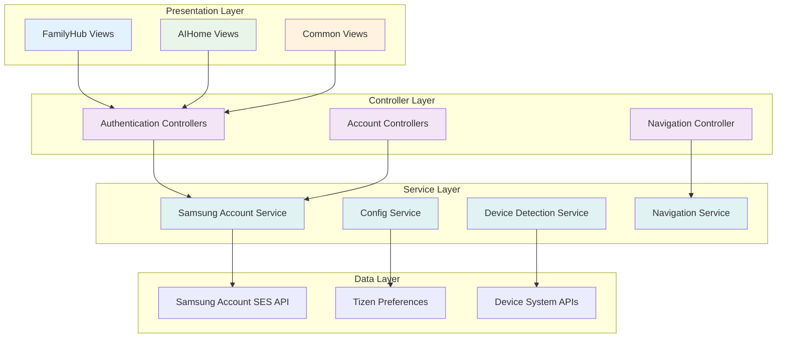

## 🎯 Core Components Class Diagram

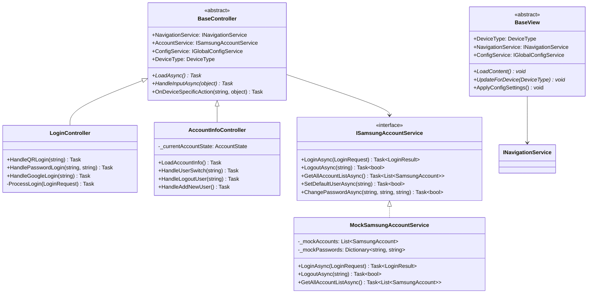

## 🔄 Data Flow Architecture

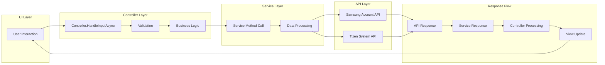

## 📱 Device-Specific Architecture

### FamilyHub Architecture (21"/32" Vertical)
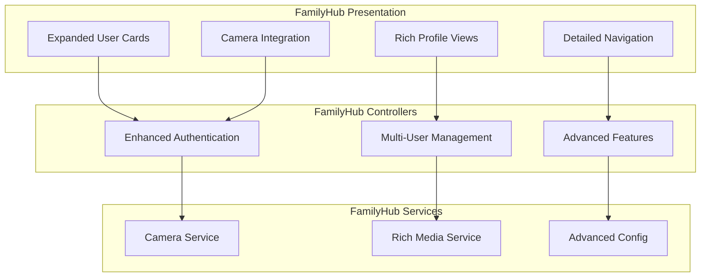

### AIHome Architecture (7"/9" Horizontal)
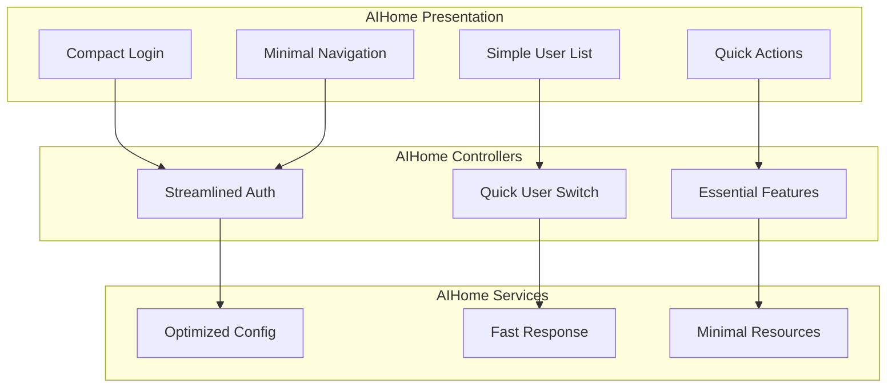

## 🔧 Service Architecture Details

### Samsung Account Service Layer
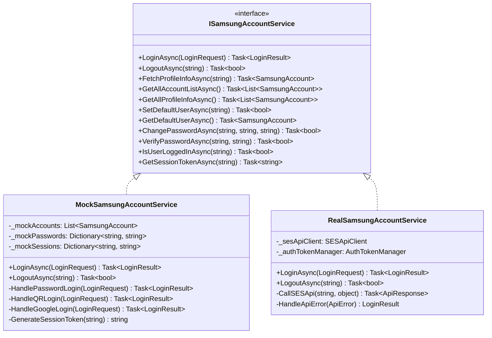

### Configuration Service Architecture
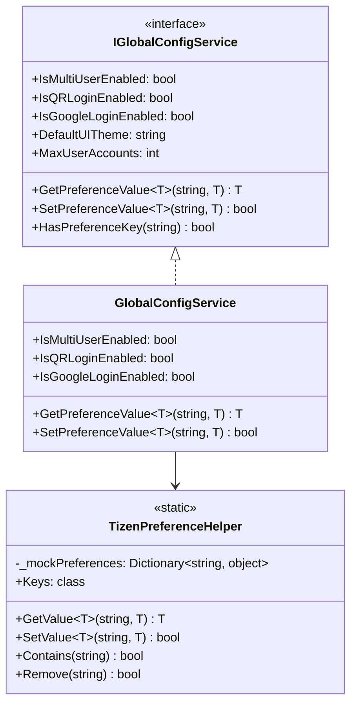

## 🚦 Navigation Architecture

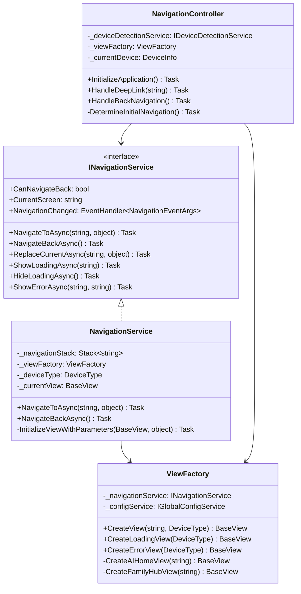

## 📊 Model Architecture

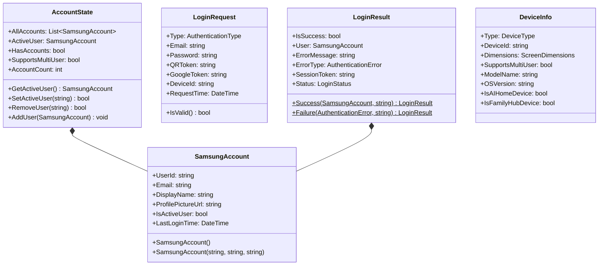

## 🔄 State Management

### Authentication State Flow
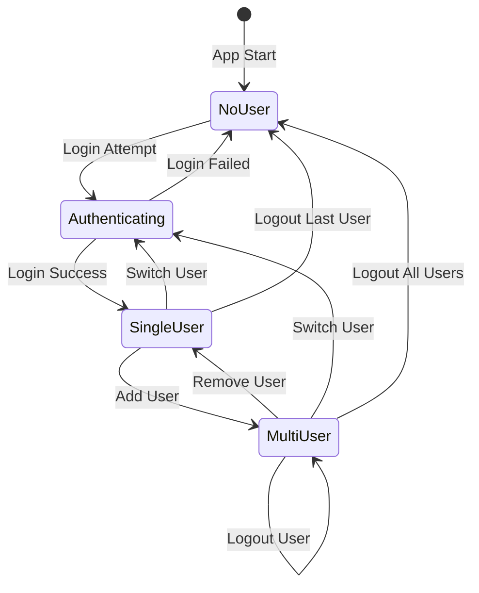

### Navigation State Flow
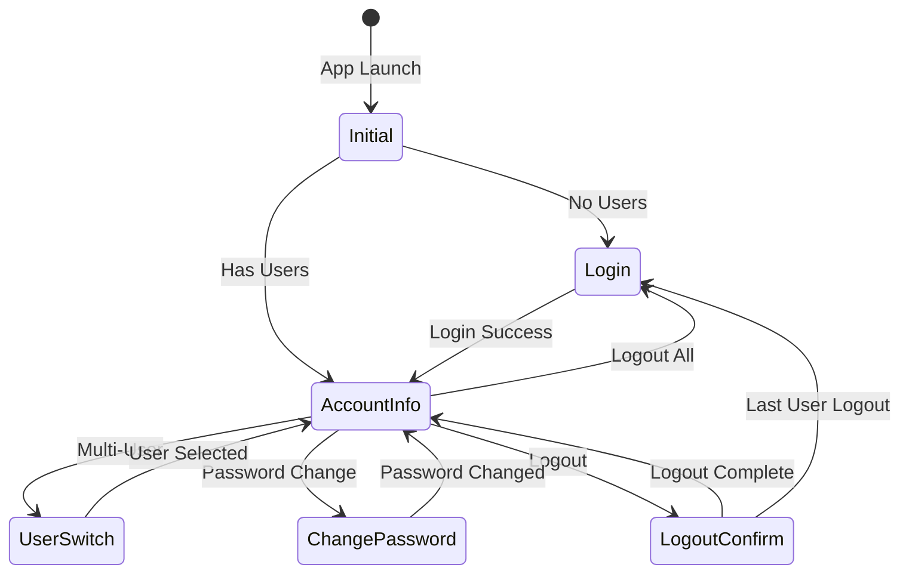

## 🎯 Key Design Patterns

### Factory Pattern
- **ViewFactory**: Creates device-specific views
- **ControllerFactory**: Instantiates controllers with dependencies

### Strategy Pattern
- **Device-specific behavior**: AIHome vs FamilyHub implementations
- **Authentication methods**: QR, Password, Google strategies

### Observer Pattern
- **Navigation events**: Screen change notifications
- **Configuration changes**: Preference update notifications

### Repository Pattern
- **Samsung Account Service**: Abstracts data access layer
- **Mock vs Real implementations**: Seamless switching

## 🔧 Dependency Injection Structure

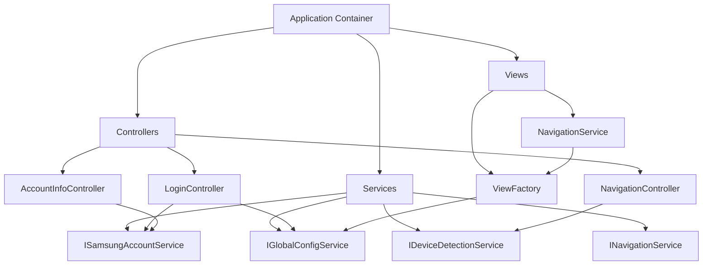

## 📈 Performance Considerations

### Memory Management
- **View lifecycle management**: Proper disposal of views
- **Service singleton pattern**: Shared service instances
- **Event handler cleanup**: Prevent memory leaks

### Caching Strategy
- **User profiles**: Cache frequently accessed user data
- **Configuration**: Cache preference values
- **Navigation state**: Maintain navigation history

### Async/Await Pattern
- **Non-blocking UI**: All I/O operations are async
- **Task composition**: Parallel operations where possible
- **Cancellation support**: Timeout and user cancellation

---

**Next**: [Sequence Diagrams](../diagrams/authentication-flows.md) for detailed interaction flows.