# Authentication Flow Sequence Diagrams

## 🔐 Overview

This document provides detailed sequence diagrams for all authentication flows in the Samsung Account UI application, including login, logout, user switching, and password management.

## 🚀 Application Startup Flow

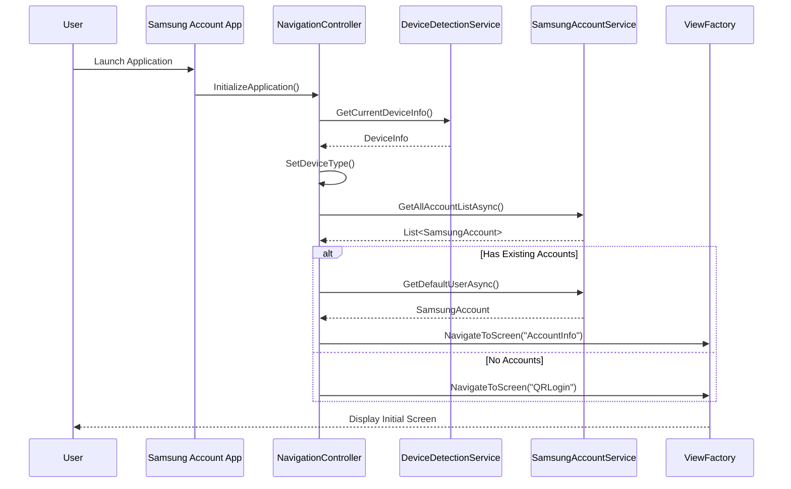

## 🔑 QR Login Flow

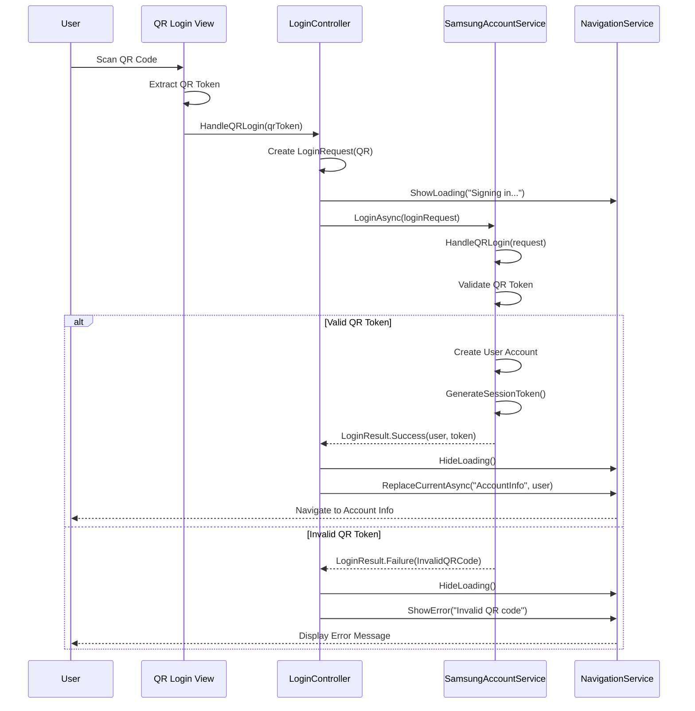

## 🔐 Password Login Flow

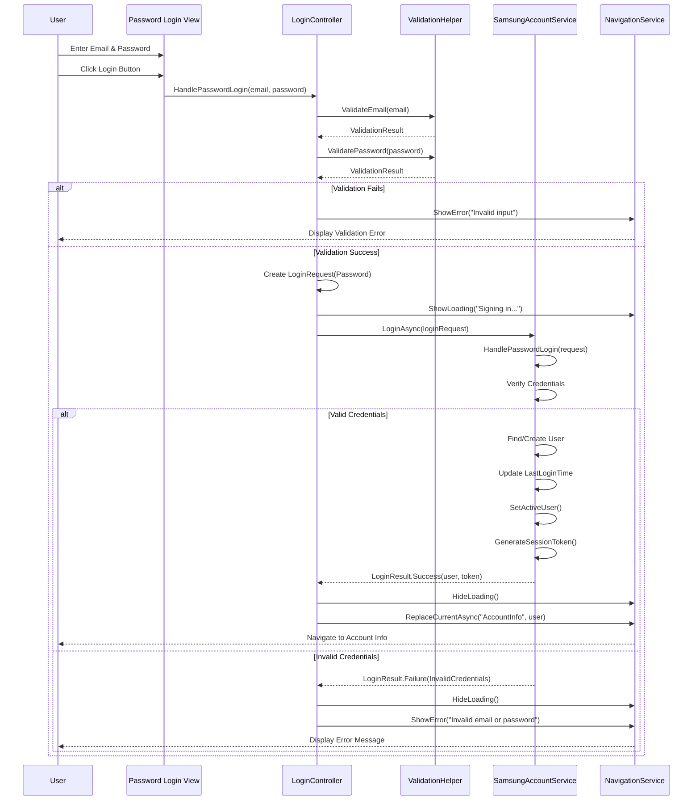

## 🌐 Google OAuth Login Flow

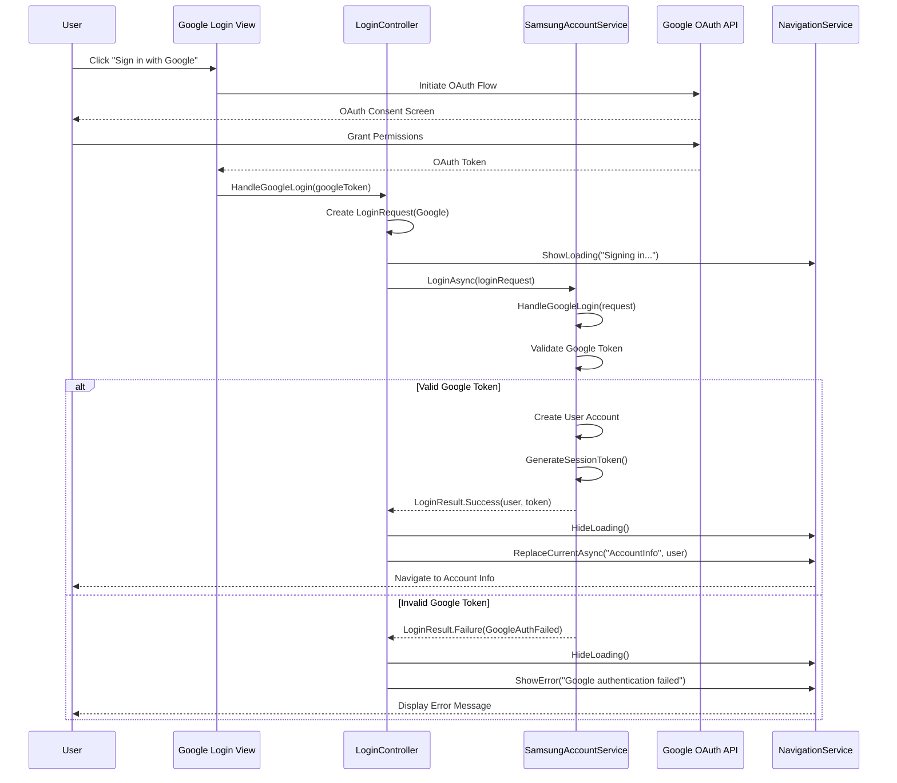

## 👥 User Switching Flow

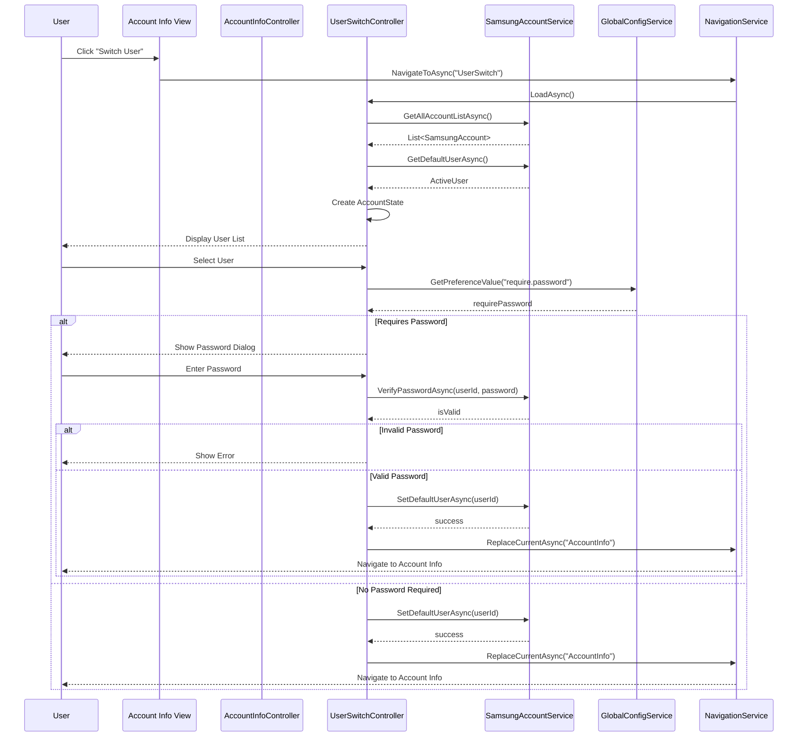

## 🚪 User Logout Flow

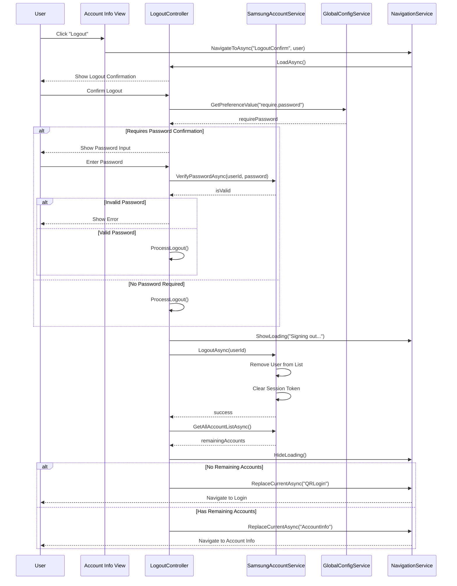

## 🔑 Password Change Flow

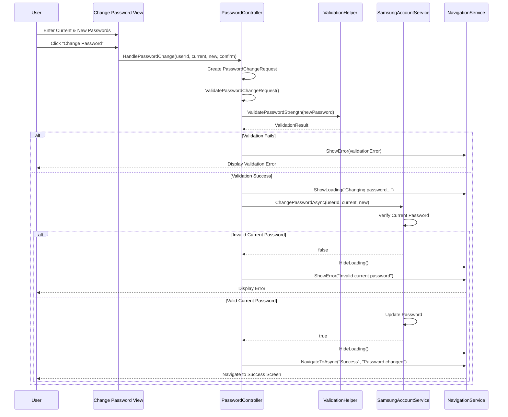

## 🚨 Error Handling Flow

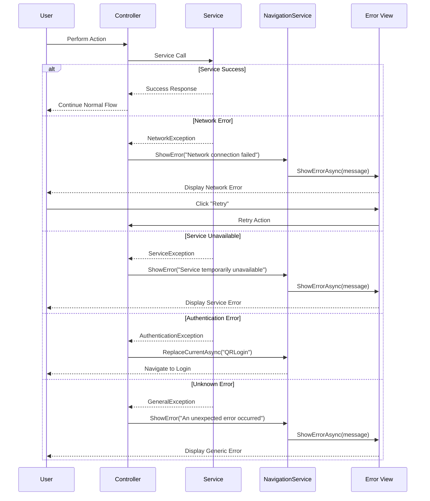

## 📱 Device-Specific Authentication Flows

### AIHome Quick Login Flow
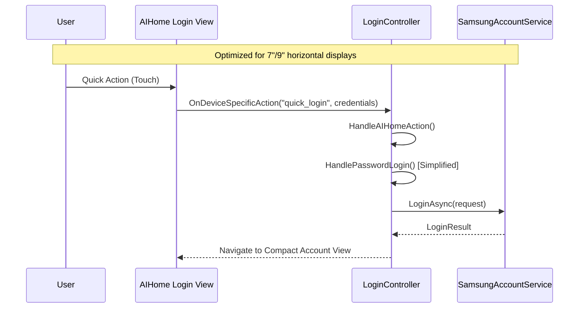

### FamilyHub Enhanced Authentication Flow
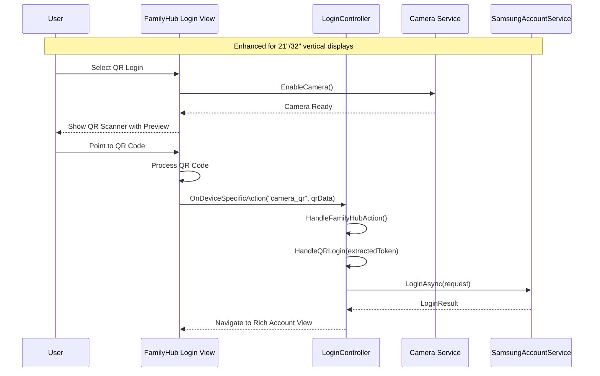

## 🔄 Session Management Flow

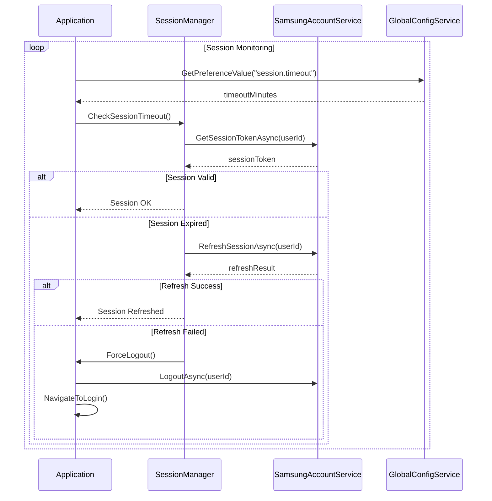

## 📊 Performance Monitoring Flow

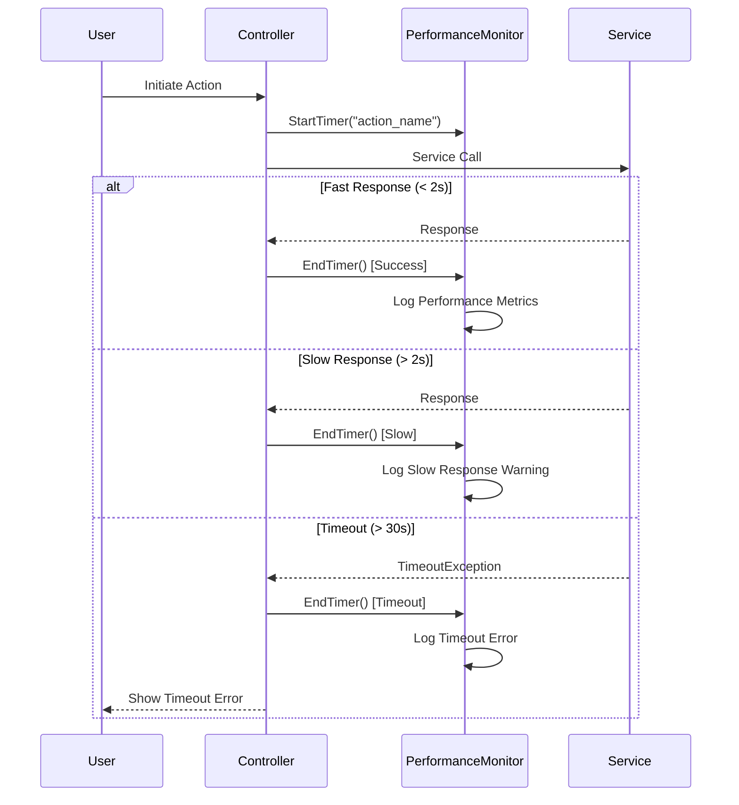

---

**Next**: [API Documentation](../api/README.md) for detailed service interfaces and methods.