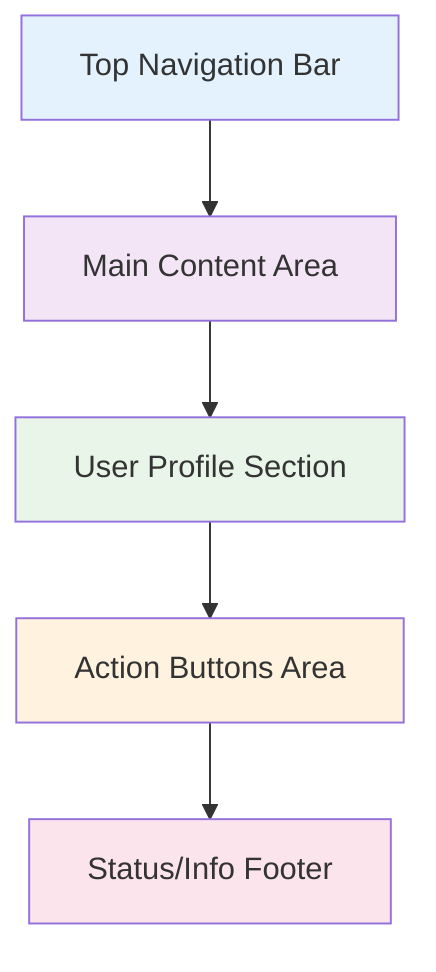
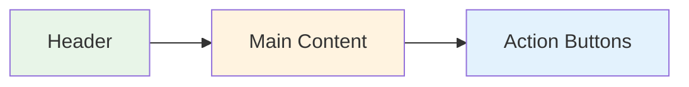

# Device-Specific Implementation Guides

## 📋 Overview

This guide provides detailed implementation instructions for optimizing the Samsung Account UI application for specific device categories: FamilyHub refrigerators and AIHome appliances (washing machines, dryers).

## 🏠 Device Categories Overview

### FamilyHub Devices (Large Vertical Displays)
- **Screen Sizes**: 21-inch, 32-inch
- **Orientation**: Portrait/Vertical (1080x1920, 1200x1920)
- **Use Case**: Kitchen hub, family interaction center
- **Interaction**: Rich touch interface, extended sessions
- **Features**: Camera, rich animations, detailed information

### AIHome Devices (Compact Horizontal Displays)
- **Screen Sizes**: 7-inch, 9-inch
- **Orientation**: Landscape/Horizontal (800x480, 1024x600)
- **Use Case**: Appliance control, quick interactions
- **Interaction**: Simple touch interface, brief sessions
- **Features**: Essential functions only, performance optimized

## 📱 FamilyHub Implementation Guide

### Layout Strategy

#### Screen Layout Principles


#### FamilyHub Layout Implementation

```csharp
using Tizen.NUI;
using Tizen.NUI.BaseComponents;
using Tizen.NUI.Components;

namespace SamsungAccountUI.Views.FamilyHub
{
    public class FamilyHubLayoutManager
    {
        public static readonly Size ScreenSize = new Size(1080, 1920);
        public static readonly int TopNavHeight = 120;
        public static readonly int FooterHeight = 80;
        public static readonly Extents LargePadding = new Extents(40, 40, 40, 40);
        public static readonly Extents MediumPadding = new Extents(20, 20, 20, 20);
        
        public static View CreateMainLayout()
        {
            var mainContainer = new View
            {
                WidthSpecification = LayoutParamPolicies.MatchParent,
                HeightSpecification = LayoutParamPolicies.MatchParent,
                Layout = new LinearLayout
                {
                    LinearOrientation = LinearLayout.Orientation.Vertical
                }
            };
            
            // Top navigation bar
            var topNavBar = CreateTopNavigationBar();
            mainContainer.Add(topNavBar);
            
            // Main content area (expandable)
            var contentArea = new View
            {
                WidthSpecification = LayoutParamPolicies.MatchParent,
                HeightSpecification = LayoutParamPolicies.FillToParent,
                Padding = LargePadding
            };
            mainContainer.Add(contentArea);
            
            // Footer status bar
            var footer = CreateFooter();
            mainContainer.Add(footer);
            
            return mainContainer;
        }
        
        private static View CreateTopNavigationBar()
        {
            var navbar = new View
            {
                WidthSpecification = LayoutParamPolicies.MatchParent,
                HeightSpecification = TopNavHeight,
                BackgroundColor = new Color(0.067f, 0.067f, 0.067f, 1.0f), // Dark background
                Layout = new LinearLayout
                {
                    LinearOrientation = LinearLayout.Orientation.Horizontal,
                    LinearAlignment = LinearLayout.Alignment.Center,
                    CellPadding = new Size2D(20, 0)
                },
                Padding = new Extents(30, 30, 15, 15)
            };
            
            // Samsung Account logo
            var logo = new ImageView
            {
                ResourceUrl = "images/samsung_account_logo_large.png",
                Size = new Size(180, 45),
                WidthSpecification = LayoutParamPolicies.WrapContent,
                HeightSpecification = LayoutParamPolicies.WrapContent
            };
            navbar.Add(logo);
            
            // Spacer
            var spacer = new View
            {
                WidthSpecification = LayoutParamPolicies.FillToParent,
                HeightSpecification = LayoutParamPolicies.WrapContent
            };
            navbar.Add(spacer);
            
            // Settings button
            var settingsButton = new Button
            {
                Text = "⚙️",
                Size = new Size(60, 60),
                PointSize = 24,
                CornerRadius = 30.0f
            };
            navbar.Add(settingsButton);
            
            // Back button
            var backButton = new Button
            {
                Text = "←",
                Size = new Size(60, 60),
                PointSize = 28,
                CornerRadius = 30.0f,
                Margin = new Extents(10, 0, 0, 0)
            };
            navbar.Add(backButton);
            
            return navbar;
        }
        
        private static View CreateFooter()
        {
            var footer = new View
            {
                WidthSpecification = LayoutParamPolicies.MatchParent,
                HeightSpecification = FooterHeight,
                BackgroundColor = new Color(0.1f, 0.1f, 0.1f, 1.0f),
                Layout = new LinearLayout
                {
                    LinearOrientation = LinearLayout.Orientation.Horizontal,
                    LinearAlignment = LinearLayout.Alignment.Center
                },
                Padding = new Extents(20, 20, 10, 10)
            };
            
            // Status indicators
            var statusText = new TextLabel
            {
                Text = "Samsung Account Connected",
                TextColor = Color.Green,
                PointSize = 14,
                HorizontalAlignment = HorizontalAlignment.Center,
                VerticalAlignment = VerticalAlignment.Center
            };
            footer.Add(statusText);
            
            return footer;
        }
        
        public static View CreateUserProfileCard(SamsungAccount user, bool isLarge = true)
        {
            var cardSize = isLarge ? new Size(320, 200) : new Size(280, 160);
            var imageSize = isLarge ? new Size(80, 80) : new Size(60, 60);
            var titleSize = isLarge ? 18f : 16f;
            
            var card = new View
            {
                Size = cardSize,
                BackgroundColor = new Color(0.15f, 0.15f, 0.15f, 1.0f),
                CornerRadius = 16.0f,
                Layout = new LinearLayout
                {
                    LinearOrientation = LinearLayout.Orientation.Vertical,
                    LinearAlignment = LinearLayout.Alignment.Center,
                    CellPadding = new Size2D(0, 15)
                },
                Padding = new Extents(20, 20, 20, 20)
            };
            
            // Profile image
            var profileImage = new ImageView
            {
                ResourceUrl = user.ProfilePictureUrl ?? "images/default_profile.png",
                Size = imageSize,
                CornerRadius = imageSize.Width / 2
            };
            card.Add(profileImage);
            
            // User name
            var nameLabel = new TextLabel
            {
                Text = user.DisplayName,
                TextColor = Color.White,
                PointSize = titleSize,
                FontStyle = new PropertyMap().Add("weight", new PropertyValue("bold")),
                HorizontalAlignment = HorizontalAlignment.Center,
                WidthSpecification = LayoutParamPolicies.WrapContent,
                HeightSpecification = LayoutParamPolicies.WrapContent
            };
            card.Add(nameLabel);
            
            // Email
            var emailLabel = new TextLabel
            {
                Text = user.Email,
                TextColor = new Color(0.8f, 0.8f, 0.8f, 1.0f),
                PointSize = 12f,
                HorizontalAlignment = HorizontalAlignment.Center,
                WidthSpecification = LayoutParamPolicies.WrapContent,
                HeightSpecification = LayoutParamPolicies.WrapContent
            };
            card.Add(emailLabel);
            
            // Active indicator
            if (user.IsActiveUser)
            {
                var activeIndicator = new View
                {
                    Size = new Size(12, 12),
                    BackgroundColor = Color.Green,
                    CornerRadius = 6.0f,
                    Position = new Position(cardSize.Width - 25, 15)
                };
                card.Add(activeIndicator);
            }
            
            return card;
        }
        
        public static View CreateLargeButton(string text, string iconPath = null)
        {
            var button = new Button
            {
                Text = text,
                Size = new Size(250, 70),
                PointSize = 18,
                CornerRadius = 12.0f,
                BackgroundColor = new Color(0.067f, 0.341f, 0.663f, 1.0f), // Samsung Blue
                TextColor = Color.White,
                Margin = new Extents(0, 0, 15, 15)
            };
            
            if (!string.IsNullOrEmpty(iconPath))
            {
                // Add icon (implementation depends on specific Button icon support)
                var icon = new ImageView
                {
                    ResourceUrl = iconPath,
                    Size = new Size(28, 28)
                };
                // Icon positioning would need specific implementation
            }
            
            return button;
        }
    }
}
```

### FamilyHub-Specific Features

#### Camera Integration for QR Scanning

```csharp
using Tizen.Multimedia;

namespace SamsungAccountUI.Views.FamilyHub.Features
{
    public class CameraQRScanner
    {
        private Camera _camera;
        private MediaView _previewView;
        private bool _isScanning;
        
        public event EventHandler<QRCodeDetectedEventArgs> QRCodeDetected;
        
        public async Task InitializeCameraAsync(View parentView)
        {
            try
            {
                // Initialize camera
                _camera = new Camera(CameraDevice.Rear);
                
                // Create preview view
                _previewView = new MediaView
                {
                    Size = new Size(400, 300),
                    CornerRadius = 12.0f
                };
                
                // Add preview overlay
                var overlay = CreateScanningOverlay();
                parentView.Add(_previewView);
                parentView.Add(overlay);
                
                // Configure camera settings
                _camera.Settings.PreviewResolution = new Size(1280, 720);
                _camera.Settings.CaptureFormat = CameraPixelFormat.Rgb888;
                
                // Set preview display
                _camera.Display = new Display(_previewView);
                
                await Task.CompletedTask;
            }
            catch (Exception ex)
            {
                throw new CameraInitializationException($"Failed to initialize camera: {ex.Message}", ex);
            }
        }
        
        public async Task StartScanningAsync()
        {
            if (_camera == null) return;
            
            try
            {
                _isScanning = true;
                _camera.StartPreview();
                
                // Start QR detection timer
                var timer = new Timer(DetectQRCode, null, TimeSpan.Zero, TimeSpan.FromMilliseconds(500));
                
                await Task.CompletedTask;
            }
            catch (Exception ex)
            {
                throw new CameraScanningException($"Failed to start QR scanning: {ex.Message}", ex);
            }
        }
        
        public async Task StopScanningAsync()
        {
            if (_camera == null) return;
            
            try
            {
                _isScanning = false;
                _camera.StopPreview();
                
                await Task.CompletedTask;
            }
            catch (Exception ex)
            {
                // Log error but don't throw - cleanup should not fail
                System.Diagnostics.Debug.WriteLine($"Error stopping camera: {ex.Message}");
            }
        }
        
        private void DetectQRCode(object state)
        {
            if (!_isScanning || _camera?.State != CameraState.Preview) return;
            
            try
            {
                // Capture frame for QR detection
                var preview = _camera.StartPreview();
                
                // Process frame with QR detection algorithm
                var qrData = ProcessFrameForQR(preview);
                
                if (!string.IsNullOrEmpty(qrData))
                {
                    _isScanning = false;
                    QRCodeDetected?.Invoke(this, new QRCodeDetectedEventArgs(qrData));
                }
            }
            catch (Exception ex)
            {
                System.Diagnostics.Debug.WriteLine($"QR detection error: {ex.Message}");
            }
        }
        
        private string ProcessFrameForQR(object frameData)
        {
            // Implement QR code detection algorithm
            // This would integrate with a QR detection library
            // For now, simulate detection
            
            if (DateTime.Now.Millisecond % 3000 < 100) // Simulate random detection
            {
                return "QR_DETECTED_TOKEN_123456";
            }
            
            return null;
        }
        
        private View CreateScanningOverlay()
        {
            var overlay = new View
            {
                Size = new Size(400, 300),
                Layout = new AbsoluteLayout()
            };
            
            // QR target frame
            var targetFrame = new View
            {
                Size = new Size(200, 200),
                Position = new Position(100, 50),
                BorderlineWidth = 3.0f,
                BorderlineColor = Color.Green,
                BackgroundColor = Color.Transparent
            };
            overlay.Add(targetFrame);
            
            // Scanning instruction
            var instruction = new TextLabel
            {
                Text = "Point camera at QR code",
                TextColor = Color.White,
                PointSize = 16,
                Position = new Position(100, 260),
                Size = new Size(200, 30),
                HorizontalAlignment = HorizontalAlignment.Center,
                BackgroundColor = new Color(0, 0, 0, 0.7f)
            };
            overlay.Add(instruction);
            
            return overlay;
        }
        
        public void Dispose()
        {
            StopScanningAsync();
            _camera?.Dispose();
            _previewView?.Dispose();
        }
    }
    
    public class QRCodeDetectedEventArgs : EventArgs
    {
        public string QRData { get; }
        
        public QRCodeDetectedEventArgs(string qrData)
        {
            QRData = qrData;
        }
    }
}
```

#### Rich Animations for FamilyHub

```csharp
namespace SamsungAccountUI.Views.FamilyHub.Animations
{
    public static class FamilyHubAnimations
    {
        public static Animation CreateUserCardAppearAnimation(View userCard)
        {
            var animation = new Animation(600);
            
            // Start from scaled down and transparent
            userCard.Scale = new Vector3(0.8f, 0.8f, 1.0f);
            userCard.Opacity = 0.0f;
            userCard.Position = new Position(0, 50);
            
            // Animate to full size and position
            animation.AnimateTo(userCard, "Scale", new Vector3(1.0f, 1.0f, 1.0f), 0, 400, new AlphaFunction(AlphaFunction.BuiltinFunctions.EaseOutBack));
            animation.AnimateTo(userCard, "Opacity", 1.0f, 0, 300);
            animation.AnimateTo(userCard, "Position", new Position(0, 0), 200, 600, new AlphaFunction(AlphaFunction.BuiltinFunctions.EaseOutQuart));
            
            return animation;
        }
        
        public static Animation CreateUserSwitchAnimation(View fromCard, View toCard)
        {
            var animation = new Animation(500);
            
            // Fade out current card
            animation.AnimateTo(fromCard, "Opacity", 0.0f, 0, 200);
            animation.AnimateTo(fromCard, "Scale", new Vector3(0.9f, 0.9f, 1.0f), 0, 200);
            
            // Fade in new card
            toCard.Opacity = 0.0f;
            toCard.Scale = new Vector3(1.1f, 1.1f, 1.0f);
            animation.AnimateTo(toCard, "Opacity", 1.0f, 200, 500);
            animation.AnimateTo(toCard, "Scale", new Vector3(1.0f, 1.0f, 1.0f), 200, 500, new AlphaFunction(AlphaFunction.BuiltinFunctions.EaseOutBack));
            
            return animation;
        }
        
        public static Animation CreateLoadingPulseAnimation(View loadingView)
        {
            var animation = new Animation(1500);
            animation.Looping = true;
            
            // Pulsing scale effect
            animation.AnimateTo(loadingView, "Scale", new Vector3(1.1f, 1.1f, 1.0f), 0, 750);
            animation.AnimateTo(loadingView, "Scale", new Vector3(1.0f, 1.0f, 1.0f), 750, 1500);
            
            // Opacity pulse
            animation.AnimateTo(loadingView, "Opacity", 0.7f, 0, 750);
            animation.AnimateTo(loadingView, "Opacity", 1.0f, 750, 1500);
            
            return animation;
        }
        
        public static Animation CreateScreenTransitionAnimation(View fromScreen, View toScreen, TransitionDirection direction)
        {
            var animation = new Animation(400);
            var screenWidth = 1080f;
            
            switch (direction)
            {
                case TransitionDirection.SlideLeft:
                    // Current screen slides out to left
                    animation.AnimateTo(fromScreen, "PositionX", -screenWidth, 0, 400, new AlphaFunction(AlphaFunction.BuiltinFunctions.EaseInQuart));
                    // New screen slides in from right
                    toScreen.PositionX = screenWidth;
                    animation.AnimateTo(toScreen, "PositionX", 0, 0, 400, new AlphaFunction(AlphaFunction.BuiltinFunctions.EaseOutQuart));
                    break;
                    
                case TransitionDirection.SlideRight:
                    // Current screen slides out to right
                    animation.AnimateTo(fromScreen, "PositionX", screenWidth, 0, 400, new AlphaFunction(AlphaFunction.BuiltinFunctions.EaseInQuart));
                    // New screen slides in from left
                    toScreen.PositionX = -screenWidth;
                    animation.AnimateTo(toScreen, "PositionX", 0, 0, 400, new AlphaFunction(AlphaFunction.BuiltinFunctions.EaseOutQuart));
                    break;
                    
                case TransitionDirection.FadeInOut:
                    // Fade out current, fade in new
                    animation.AnimateTo(fromScreen, "Opacity", 0.0f, 0, 200);
                    toScreen.Opacity = 0.0f;
                    animation.AnimateTo(toScreen, "Opacity", 1.0f, 200, 400);
                    break;
            }
            
            return animation;
        }
    }
    
    public enum TransitionDirection
    {
        SlideLeft,
        SlideRight,
        SlideUp,
        SlideDown,
        FadeInOut
    }
}
```

## 🏠 AIHome Implementation Guide

### Compact Layout Strategy

#### AIHome Layout Principles


#### AIHome Layout Implementation

```csharp
namespace SamsungAccountUI.Views.AIHome
{
    public class AIHomeLayoutManager
    {
        public static readonly Size SmallScreenSize = new Size(800, 480);
        public static readonly Size MediumScreenSize = new Size(1024, 600);
        public static readonly int HeaderHeight = 60;
        public static readonly int ButtonHeight = 45;
        public static readonly Extents CompactPadding = new Extents(15, 15, 15, 15);
        public static readonly Extents MinimalPadding = new Extents(8, 8, 8, 8);
        
        public static View CreateCompactMainLayout()
        {
            var mainContainer = new View
            {
                WidthSpecification = LayoutParamPolicies.MatchParent,
                HeightSpecification = LayoutParamPolicies.MatchParent,
                Layout = new LinearLayout
                {
                    LinearOrientation = LinearLayout.Orientation.Vertical
                }
            };
            
            // Compact header
            var header = CreateCompactHeader();
            mainContainer.Add(header);
            
            // Main content area (horizontal split)
            var contentArea = new View
            {
                WidthSpecification = LayoutParamPolicies.MatchParent,
                HeightSpecification = LayoutParamPolicies.FillToParent,
                Layout = new LinearLayout
                {
                    LinearOrientation = LinearLayout.Orientation.Horizontal,
                    CellPadding = new Size2D(20, 0)
                },
                Padding = CompactPadding
            };
            mainContainer.Add(contentArea);
            
            return mainContainer;
        }
        
        private static View CreateCompactHeader()
        {
            var header = new View
            {
                WidthSpecification = LayoutParamPolicies.MatchParent,
                HeightSpecification = HeaderHeight,
                BackgroundColor = new Color(0.067f, 0.067f, 0.067f, 1.0f),
                Layout = new LinearLayout
                {
                    LinearOrientation = LinearLayout.Orientation.Horizontal,
                    LinearAlignment = LinearLayout.Alignment.Center,
                    CellPadding = new Size2D(15, 0)
                },
                Padding = new Extents(20, 20, 10, 10)
            };
            
            // Compact logo
            var logo = new TextLabel
            {
                Text = "Samsung Account",
                TextColor = Color.White,
                PointSize = 16,
                FontStyle = new PropertyMap().Add("weight", new PropertyValue("bold")),
                WidthSpecification = LayoutParamPolicies.WrapContent,
                HeightSpecification = LayoutParamPolicies.WrapContent
            };
            header.Add(logo);
            
            // Spacer
            var spacer = new View
            {
                WidthSpecification = LayoutParamPolicies.FillToParent,
                HeightSpecification = LayoutParamPolicies.WrapContent
            };
            header.Add(spacer);
            
            // Minimal back button
            var backButton = new Button
            {
                Text = "‹",
                Size = new Size(40, 40),
                PointSize = 20,
                CornerRadius = 20.0f
            };
            header.Add(backButton);
            
            return header;
        }
        
        public static View CreateCompactUserCard(SamsungAccount user)
        {
            var card = new View
            {
                Size = new Size(180, 120),
                BackgroundColor = new Color(0.15f, 0.15f, 0.15f, 1.0f),
                CornerRadius = 8.0f,
                Layout = new LinearLayout
                {
                    LinearOrientation = LinearLayout.Orientation.Horizontal,
                    LinearAlignment = LinearLayout.Alignment.Center,
                    CellPadding = new Size2D(10, 0)
                },
                Padding = new Extents(12, 12, 12, 12)
            };
            
            // Small profile image
            var profileImage = new ImageView
            {
                ResourceUrl = user.ProfilePictureUrl ?? "images/default_profile_small.png",
                Size = new Size(40, 40),
                CornerRadius = 20.0f
            };
            card.Add(profileImage);
            
            // User info container
            var infoContainer = new View
            {
                WidthSpecification = LayoutParamPolicies.FillToParent,
                HeightSpecification = LayoutParamPolicies.MatchParent,
                Layout = new LinearLayout
                {
                    LinearOrientation = LinearLayout.Orientation.Vertical,
                    LinearAlignment = LinearLayout.Alignment.Center
                }
            };
            
            // Compact name (truncated if too long)
            var name = user.DisplayName.Length > 12 ? user.DisplayName.Substring(0, 12) + "..." : user.DisplayName;
            var nameLabel = new TextLabel
            {
                Text = name,
                TextColor = Color.White,
                PointSize = 12,
                FontStyle = new PropertyMap().Add("weight", new PropertyValue("bold")),
                HorizontalAlignment = HorizontalAlignment.Begin,
                WidthSpecification = LayoutParamPolicies.WrapContent,
                HeightSpecification = LayoutParamPolicies.WrapContent
            };
            infoContainer.Add(nameLabel);
            
            // Status indicator
            var statusText = user.IsActiveUser ? "Active" : "Switch";
            var statusLabel = new TextLabel
            {
                Text = statusText,
                TextColor = user.IsActiveUser ? Color.Green : new Color(0.8f, 0.8f, 0.8f, 1.0f),
                PointSize = 10,
                HorizontalAlignment = HorizontalAlignment.Begin,
                WidthSpecification = LayoutParamPolicies.WrapContent,
                HeightSpecification = LayoutParamPolicies.WrapContent
            };
            infoContainer.Add(statusLabel);
            
            card.Add(infoContainer);
            
            return card;
        }
        
        public static View CreateCompactButton(string text, Action clickHandler = null)
        {
            var button = new Button
            {
                Text = text,
                Size = new Size(120, ButtonHeight),
                PointSize = 12,
                CornerRadius = 6.0f,
                BackgroundColor = new Color(0.067f, 0.341f, 0.663f, 1.0f),
                TextColor = Color.White,
                Margin = new Extents(0, 0, 8, 8)
            };
            
            if (clickHandler != null)
            {
                button.Clicked += (s, e) => clickHandler();
            }
            
            return button;
        }
        
        public static View CreateHorizontalButtonRow(params (string text, Action action)[] buttons)
        {
            var container = new View
            {
                WidthSpecification = LayoutParamPolicies.WrapContent,
                HeightSpecification = LayoutParamPolicies.WrapContent,
                Layout = new LinearLayout
                {
                    LinearOrientation = LinearLayout.Orientation.Horizontal,
                    CellPadding = new Size2D(10, 0)
                }
            };
            
            foreach (var (text, action) in buttons)
            {
                var button = CreateCompactButton(text, action);
                container.Add(button);
            }
            
            return container;
        }
        
        public static View CreateCompactQRDisplay(string qrImagePath)
        {
            var container = new View
            {
                Size = new Size(160, 180),
                Layout = new LinearLayout
                {
                    LinearOrientation = LinearLayout.Orientation.Vertical,
                    LinearAlignment = LinearLayout.Alignment.Center,
                    CellPadding = new Size2D(0, 10)
                }
            };
            
            // QR background
            var qrBackground = new View
            {
                Size = new Size(140, 140),
                BackgroundColor = Color.White,
                CornerRadius = 8.0f,
                Layout = new LinearLayout
                {
                    LinearAlignment = LinearLayout.Alignment.Center
                }
            };
            
            // QR image
            var qrImage = new ImageView
            {
                ResourceUrl = qrImagePath,
                Size = new Size(120, 120)
            };
            qrBackground.Add(qrImage);
            container.Add(qrBackground);
            
            // Refresh button
            var refreshButton = new Button
            {
                Text = "↻",
                Size = new Size(30, 30),
                PointSize = 16,
                CornerRadius = 15.0f
            };
            container.Add(refreshButton);
            
            return container;
        }
    }
}
```

### AIHome Performance Optimizations

```csharp
namespace SamsungAccountUI.Views.AIHome.Optimizations
{
    public static class AIHomePerformanceManager
    {
        public static void OptimizeForLowEnd()
        {
            // Disable animations on low-end devices
            DisableAnimations();
            
            // Reduce image quality
            SetImageQuality(ImageQuality.Low);
            
            // Use simplified layouts
            EnableSimplifiedLayouts();
            
            // Optimize garbage collection
            OptimizeGC();
        }
        
        private static void DisableAnimations()
        {
            // Disable all view animations for better performance
            Animation.GlobalSettings.PlaybackSpeed = 0.0f;
        }
        
        private static void SetImageQuality(ImageQuality quality)
        {
            // Configure image loading for reduced memory usage
            ImageLoader.DefaultQuality = quality;
        }
        
        private static void EnableSimplifiedLayouts()
        {
            // Use simpler layout managers
            LayoutManager.UseSimplifiedLayouts = true;
        }
        
        private static void OptimizeGC()
        {
            // Configure garbage collection for better performance
            GC.Collect(0, GCCollectionMode.Optimized);
        }
        
        public static void OptimizeMemoryUsage()
        {
            // Implement view recycling
            ViewPool.EnableRecycling = true;
            ViewPool.MaxPoolSize = 10;
            
            // Cache management
            ImageCache.MaxCacheSize = 1024 * 1024; // 1MB cache
            
            // Dispose unused resources
            ResourceManager.DisposeUnusedResources();
        }
        
        public static bool IsLowEndDevice()
        {
            // Check device capabilities
            var deviceInfo = DeviceDetectionService.GetCurrentDeviceInfo();
            
            // Consider 7" devices as low-end
            return deviceInfo.Dimensions.Width <= 800;
        }
    }
    
    public enum ImageQuality
    {
        Low,
        Medium,
        High
    }
    
    public static class ImageLoader
    {
        public static ImageQuality DefaultQuality { get; set; } = ImageQuality.Medium;
        
        public static ImageView LoadOptimizedImage(string path, Size targetSize)
        {
            var imageView = new ImageView();
            
            switch (DefaultQuality)
            {
                case ImageQuality.Low:
                    imageView.ResourceUrl = GetLowQualityPath(path);
                    break;
                case ImageQuality.Medium:
                    imageView.ResourceUrl = GetMediumQualityPath(path);
                    break;
                case ImageQuality.High:
                    imageView.ResourceUrl = path;
                    break;
            }
            
            imageView.Size = targetSize;
            return imageView;
        }
        
        private static string GetLowQualityPath(string originalPath)
        {
            return originalPath.Replace(".png", "_low.png").Replace(".jpg", "_low.jpg");
        }
        
        private static string GetMediumQualityPath(string originalPath)
        {
            return originalPath.Replace(".png", "_med.png").Replace(".jpg", "_med.jpg");
        }
    }
}
```

## 🔀 Cross-Device Compatibility

### Responsive Design System

```csharp
namespace SamsungAccountUI.Views.Responsive
{
    public class ResponsiveLayoutManager
    {
        public static View CreateResponsiveLayout(DeviceType deviceType, string layoutType)
        {
            return deviceType switch
            {
                DeviceType.FamilyHub => CreateFamilyHubLayout(layoutType),
                DeviceType.AIHome => CreateAIHomeLayout(layoutType),
                _ => throw new NotSupportedException($"Device type {deviceType} not supported")
            };
        }
        
        private static View CreateFamilyHubLayout(string layoutType)
        {
            return layoutType switch
            {
                "login" => FamilyHubLayoutManager.CreateMainLayout(),
                "account_info" => CreateFamilyHubAccountLayout(),
                "user_switch" => CreateFamilyHubUserSwitchLayout(),
                _ => FamilyHubLayoutManager.CreateMainLayout()
            };
        }
        
        private static View CreateAIHomeLayout(string layoutType)
        {
            return layoutType switch
            {
                "login" => AIHomeLayoutManager.CreateCompactMainLayout(),
                "account_info" => CreateAIHomeAccountLayout(),
                "user_switch" => CreateAIHomeUserSwitchLayout(),
                _ => AIHomeLayoutManager.CreateCompactMainLayout()
            };
        }
        
        private static View CreateFamilyHubAccountLayout()
        {
            var layout = FamilyHubLayoutManager.CreateMainLayout();
            
            // Add rich account info components
            var userGrid = new View
            {
                Layout = new GridLayout
                {
                    Columns = 2,
                    Rows = 3,
                    CellPadding = new Size2D(20, 20)
                }
            };
            
            // Large user cards for FamilyHub
            for (int i = 0; i < 6; i++)
            {
                var userCard = FamilyHubLayoutManager.CreateUserProfileCard(
                    TestData.MockUsers[i % TestData.MockUsers.Count], 
                    isLarge: true);
                userGrid.Add(userCard);
            }
            
            return layout;
        }
        
        private static View CreateAIHomeAccountLayout()
        {
            var layout = AIHomeLayoutManager.CreateCompactMainLayout();
            
            // Add compact account info components
            var userRow = new View
            {
                Layout = new LinearLayout
                {
                    LinearOrientation = LinearLayout.Orientation.Horizontal,
                    CellPadding = new Size2D(10, 0)
                }
            };
            
            // Compact user cards for AIHome (max 3 visible)
            for (int i = 0; i < Math.Min(3, TestData.MockUsers.Count); i++)
            {
                var userCard = AIHomeLayoutManager.CreateCompactUserCard(TestData.MockUsers[i]);
                userRow.Add(userCard);
            }
            
            return layout;
        }
        
        public static float GetScalingFactor(DeviceType deviceType)
        {
            return deviceType switch
            {
                DeviceType.FamilyHub => 1.0f,    // No scaling for large screens
                DeviceType.AIHome => 0.75f,      // Scale down for small screens
                _ => 1.0f
            };
        }
        
        public static Size GetOptimalImageSize(DeviceType deviceType, ImageType imageType)
        {
            return (deviceType, imageType) switch
            {
                (DeviceType.FamilyHub, ImageType.ProfilePicture) => new Size(80, 80),
                (DeviceType.AIHome, ImageType.ProfilePicture) => new Size(40, 40),
                (DeviceType.FamilyHub, ImageType.QRCode) => new Size(300, 300),
                (DeviceType.AIHome, ImageType.QRCode) => new Size(120, 120),
                _ => new Size(60, 60)
            };
        }
    }
    
    public enum ImageType
    {
        ProfilePicture,
        QRCode,
        Logo,
        Icon
    }
}
```

### Device Feature Detection

```csharp
namespace SamsungAccountUI.Services.Device
{
    public class DeviceFeatureDetector
    {
        public static DeviceCapabilities DetectCapabilities(DeviceType deviceType)
        {
            return deviceType switch
            {
                DeviceType.FamilyHub => new DeviceCapabilities
                {
                    HasCamera = true,
                    HasLargeScreen = true,
                    SupportsRichAnimations = true,
                    SupportsMultiTouch = true,
                    HasHighDPI = true,
                    MaxConcurrentUsers = 6,
                    SupportedAuthMethods = new[] { "QR", "Password", "Google", "Camera" }
                },
                DeviceType.AIHome => new DeviceCapabilities
                {
                    HasCamera = false,
                    HasLargeScreen = false,
                    SupportsRichAnimations = false,
                    SupportsMultiTouch = true,
                    HasHighDPI = false,
                    MaxConcurrentUsers = 4,
                    SupportedAuthMethods = new[] { "QR", "Password", "Google" }
                },
                _ => new DeviceCapabilities()
            };
        }
        
        public static bool SupportsFeature(DeviceType deviceType, string feature)
        {
            var capabilities = DetectCapabilities(deviceType);
            
            return feature.ToLower() switch
            {
                "camera" => capabilities.HasCamera,
                "rich_animations" => capabilities.SupportsRichAnimations,
                "large_screen" => capabilities.HasLargeScreen,
                "multi_touch" => capabilities.SupportsMultiTouch,
                "high_dpi" => capabilities.HasHighDPI,
                _ => false
            };
        }
        
        public static void OptimizeForDevice(DeviceType deviceType, View view)
        {
            var capabilities = DetectCapabilities(deviceType);
            
            if (!capabilities.SupportsRichAnimations)
            {
                // Disable animations for low-end devices
                DisableAnimationsRecursively(view);
            }
            
            if (!capabilities.HasHighDPI)
            {
                // Use lower resolution assets
                OptimizeImagesRecursively(view);
            }
            
            if (!capabilities.HasLargeScreen)
            {
                // Apply compact layout
                ApplyCompactLayoutRecursively(view);
            }
        }
        
        private static void DisableAnimationsRecursively(View view)
        {
            // Disable animations for this view and all children
            view.Focusable = false; // Disable focus animations
            
            foreach (var child in view.Children)
            {
                DisableAnimationsRecursively(child);
            }
        }
        
        private static void OptimizeImagesRecursively(View view)
        {
            if (view is ImageView imageView)
            {
                // Replace with lower resolution version
                var originalUrl = imageView.ResourceUrl;
                imageView.ResourceUrl = GetLowResolutionPath(originalUrl);
            }
            
            foreach (var child in view.Children)
            {
                OptimizeImagesRecursively(child);
            }
        }
        
        private static void ApplyCompactLayoutRecursively(View view)
        {
            // Reduce margins and padding
            if (view.Margin != null)
            {
                view.Margin = new Extents(
                    (ushort)(view.Margin.Start / 2),
                    (ushort)(view.Margin.End / 2),
                    (ushort)(view.Margin.Top / 2),
                    (ushort)(view.Margin.Bottom / 2)
                );
            }
            
            if (view.Padding != null)
            {
                view.Padding = new Extents(
                    (ushort)(view.Padding.Start / 2),
                    (ushort)(view.Padding.End / 2),
                    (ushort)(view.Padding.Top / 2),
                    (ushort)(view.Padding.Bottom / 2)
                );
            }
            
            // Reduce font sizes
            if (view is TextLabel textLabel)
            {
                textLabel.PointSize *= 0.9f;
            }
            
            foreach (var child in view.Children)
            {
                ApplyCompactLayoutRecursively(child);
            }
        }
        
        private static string GetLowResolutionPath(string originalPath)
        {
            return originalPath.Replace(".png", "_lowres.png").Replace(".jpg", "_lowres.jpg");
        }
    }
    
    public class DeviceCapabilities
    {
        public bool HasCamera { get; set; }
        public bool HasLargeScreen { get; set; }
        public bool SupportsRichAnimations { get; set; }
        public bool SupportsMultiTouch { get; set; }
        public bool HasHighDPI { get; set; }
        public int MaxConcurrentUsers { get; set; }
        public string[] SupportedAuthMethods { get; set; } = new string[0];
    }
}
```

## 📊 Performance Benchmarks

### Device-Specific Performance Targets

| Metric | FamilyHub Target | AIHome Target |
|--------|------------------|---------------|
| App Startup | < 3 seconds | < 2 seconds |
| Screen Transition | < 500ms | < 300ms |
| Login Response | < 2 seconds | < 1.5 seconds |
| Memory Usage | < 150MB | < 80MB |
| Animation FPS | 60 FPS | 30 FPS |

### Performance Monitoring

```csharp
namespace SamsungAccountUI.Performance
{
    public class DevicePerformanceMonitor
    {
        private readonly DeviceType _deviceType;
        private readonly Dictionary<string, PerformanceMetric> _metrics = new();
        
        public DevicePerformanceMonitor(DeviceType deviceType)
        {
            _deviceType = deviceType;
        }
        
        public void StartMeasurement(string operationName)
        {
            _metrics[operationName] = new PerformanceMetric
            {
                Name = operationName,
                StartTime = DateTime.Now,
                StartMemory = GC.GetTotalMemory(false)
            };
        }
        
        public void EndMeasurement(string operationName)
        {
            if (_metrics.ContainsKey(operationName))
            {
                var metric = _metrics[operationName];
                metric.EndTime = DateTime.Now;
                metric.EndMemory = GC.GetTotalMemory(false);
                
                ValidatePerformance(metric);
            }
        }
        
        private void ValidatePerformance(PerformanceMetric metric)
        {
            var duration = metric.Duration;
            var memoryUsed = metric.MemoryUsed;
            
            var targets = GetPerformanceTargets(_deviceType);
            
            if (targets.ContainsKey(metric.Name))
            {
                var target = targets[metric.Name];
                
                if (duration > target.MaxDuration)
                {
                    LogPerformanceWarning(metric, $"Operation took {duration.TotalMilliseconds}ms, exceeding target of {target.MaxDuration.TotalMilliseconds}ms");
                }
                
                if (memoryUsed > target.MaxMemoryIncrease)
                {
                    LogPerformanceWarning(metric, $"Operation used {memoryUsed} bytes, exceeding target of {target.MaxMemoryIncrease} bytes");
                }
            }
        }
        
        private Dictionary<string, PerformanceTarget> GetPerformanceTargets(DeviceType deviceType)
        {
            return deviceType switch
            {
                DeviceType.FamilyHub => new Dictionary<string, PerformanceTarget>
                {
                    ["screen_transition"] = new PerformanceTarget { MaxDuration = TimeSpan.FromMilliseconds(500), MaxMemoryIncrease = 1024 * 1024 },
                    ["login"] = new PerformanceTarget { MaxDuration = TimeSpan.FromSeconds(2), MaxMemoryIncrease = 2 * 1024 * 1024 },
                    ["user_switch"] = new PerformanceTarget { MaxDuration = TimeSpan.FromMilliseconds(800), MaxMemoryIncrease = 512 * 1024 }
                },
                DeviceType.AIHome => new Dictionary<string, PerformanceTarget>
                {
                    ["screen_transition"] = new PerformanceTarget { MaxDuration = TimeSpan.FromMilliseconds(300), MaxMemoryIncrease = 512 * 1024 },
                    ["login"] = new PerformanceTarget { MaxDuration = TimeSpan.FromMilliseconds(1500), MaxMemoryIncrease = 1024 * 1024 },
                    ["user_switch"] = new PerformanceTarget { MaxDuration = TimeSpan.FromMilliseconds(500), MaxMemoryIncrease = 256 * 1024 }
                },
                _ => new Dictionary<string, PerformanceTarget>()
            };
        }
        
        private void LogPerformanceWarning(PerformanceMetric metric, string warning)
        {
            System.Diagnostics.Debug.WriteLine($"[PERFORMANCE WARNING] {warning}");
            // In production, this would log to proper logging system
        }
    }
    
    public class PerformanceMetric
    {
        public string Name { get; set; }
        public DateTime StartTime { get; set; }
        public DateTime EndTime { get; set; }
        public long StartMemory { get; set; }
        public long EndMemory { get; set; }
        
        public TimeSpan Duration => EndTime - StartTime;
        public long MemoryUsed => EndMemory - StartMemory;
    }
    
    public class PerformanceTarget
    {
        public TimeSpan MaxDuration { get; set; }
        public long MaxMemoryIncrease { get; set; }
    }
}
```

---

This comprehensive guide provides device-specific implementation details for both FamilyHub and AIHome devices, ensuring optimal user experience across different Samsung appliance categories.