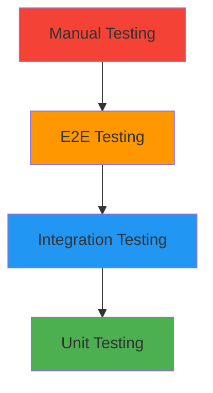

# Testing and Deployment Guide

## 📋 Overview

This guide provides a comprehensive testing strategy and deployment approach for the Samsung Account UI application, covering unit testing, integration testing, UI testing, performance testing, and production deployment.

## 🧪 Testing Strategy Overview

### Testing Pyramid



### Testing Levels

1. **Unit Tests (70%)**: Test individual components in isolation
2. **Integration Tests (20%)**: Test component interactions
3. **End-to-End Tests (8%)**: Test complete user workflows
4. **Manual Tests (2%)**: Exploratory and device-specific testing

## 🔧 Unit Testing Framework

### Test Project Structure

```
tests/
├── UnitTests/
│   ├── Controllers/
│   │   ├── LoginControllerTests.cs
│   │   ├── AccountInfoControllerTests.cs
│   │   └── LogoutControllerTests.cs
│   ├── Services/
│   │   ├── MockSamsungAccountServiceTests.cs
│   │   ├── GlobalConfigServiceTests.cs
│   │   └── DeviceDetectionServiceTests.cs
│   ├── Models/
│   │   ├── SamsungAccountTests.cs
│   │   ├── AccountStateTests.cs
│   │   └── LoginRequestTests.cs
│   ├── Utils/
│   │   ├── ValidationHelperTests.cs
│   │   ├── ViewFactoryTests.cs
│   │   └── ControllerFactoryTests.cs
│   └── TestBase/
│       ├── TestBase.cs
│       ├── MockServices.cs
│       └── TestData.cs
├── IntegrationTests/
│   ├── AuthenticationFlowTests.cs
│   ├── NavigationFlowTests.cs
│   ├── UserManagementTests.cs
│   └── DeviceSpecificTests.cs
├── UITests/
│   ├── LoginScreenTests.cs
│   ├── AccountInfoScreenTests.cs
│   └── DeviceLayoutTests.cs
└── PerformanceTests/
    ├── LoginPerformanceTests.cs
    ├── NavigationPerformanceTests.cs
    └── MemoryUsageTests.cs
```

### Unit Test Base Classes

```csharp
using Microsoft.VisualStudio.TestTools.UnitTesting;
using Moq;
using SamsungAccountUI.Services.API;
using SamsungAccountUI.Services.Config;
using SamsungAccountUI.Views.Navigation;

namespace SamsungAccountUI.Tests.TestBase
{
    [TestClass]
    public abstract class TestBase
    {
        protected Mock<ISamsungAccountService> MockAccountService { get; private set; }
        protected Mock<IGlobalConfigService> MockConfigService { get; private set; }
        protected Mock<INavigationService> MockNavigationService { get; private set; }
        protected Mock<IDeviceDetectionService> MockDeviceDetectionService { get; private set; }
        
        [TestInitialize]
        public virtual void Setup()
        {
            MockAccountService = new Mock<ISamsungAccountService>();
            MockConfigService = new Mock<IGlobalConfigService>();
            MockNavigationService = new Mock<INavigationService>();
            MockDeviceDetectionService = new Mock<IDeviceDetectionService>();
            
            SetupDefaultMockBehavior();
        }
        
        [TestCleanup]
        public virtual void Cleanup()
        {
            MockAccountService?.Reset();
            MockConfigService?.Reset();
            MockNavigationService?.Reset();
            MockDeviceDetectionService?.Reset();
        }
        
        protected virtual void SetupDefaultMockBehavior()
        {
            // Default mock behaviors
            MockConfigService.Setup(x => x.IsMultiUserEnabled).Returns(true);
            MockConfigService.Setup(x => x.IsQRLoginEnabled).Returns(true);
            MockConfigService.Setup(x => x.IsPasswordLoginEnabled).Returns(true);
            MockConfigService.Setup(x => x.IsGoogleLoginEnabled).Returns(true);
            MockConfigService.Setup(x => x.MaxUserAccounts).Returns(6);
            
            MockDeviceDetectionService.Setup(x => x.DetectDeviceType()).Returns(DeviceType.FamilyHub);
            MockDeviceDetectionService.Setup(x => x.IsDeviceSupported()).Returns(true);
        }
        
        protected SamsungAccount CreateTestUser(string userId = "test_user", bool isActive = false)
        {
            return new SamsungAccount
            {
                UserId = userId,
                Email = $"{userId}@test.com",
                DisplayName = $"Test User {userId}",
                IsActiveUser = isActive,
                LastLoginTime = DateTime.Now
            };
        }
        
        protected LoginRequest CreatePasswordLoginRequest(string email = "test@test.com", string password = "password123")
        {
            return new LoginRequest(AuthenticationType.Password)
            {
                Email = email,
                Password = password,
                DeviceId = "test_device"
            };
        }
        
        protected LoginResult CreateSuccessfulLoginResult(SamsungAccount user = null)
        {
            user ??= CreateTestUser("test_user", true);
            return LoginResult.Success(user, "test_session_token");
        }
        
        protected LoginResult CreateFailedLoginResult(AuthenticationError errorType = AuthenticationError.InvalidCredentials)
        {
            return LoginResult.Failure(errorType, "Test error message");
        }
    }
    
    public static class TestData
    {
        public static readonly List<SamsungAccount> MockUsers = new List<SamsungAccount>
        {
            new SamsungAccount
            {
                UserId = "user1",
                Email = "john@samsung.com",
                DisplayName = "John Doe",
                IsActiveUser = true,
                LastLoginTime = DateTime.Now.AddHours(-2)
            },
            new SamsungAccount
            {
                UserId = "user2", 
                Email = "jane@samsung.com",
                DisplayName = "Jane Smith",
                IsActiveUser = false,
                LastLoginTime = DateTime.Now.AddDays(-1)
            },
            new SamsungAccount
            {
                UserId = "user3",
                Email = "bob@samsung.com", 
                DisplayName = "Bob Johnson",
                IsActiveUser = false,
                LastLoginTime = DateTime.Now.AddDays(-3)
            }
        };
        
        public static readonly Dictionary<string, string> MockPasswords = new Dictionary<string, string>
        {
            { "john@samsung.com", "password123" },
            { "jane@samsung.com", "securepass456" },
            { "bob@samsung.com", "mypassword789" }
        };
    }
}
```

### Controller Unit Tests

```csharp
using Microsoft.VisualStudio.TestTools.UnitTesting;
using Moq;
using SamsungAccountUI.Controllers.Authentication;
using SamsungAccountUI.Models.Authentication;
using SamsungAccountUI.Tests.TestBase;

namespace SamsungAccountUI.Tests.Controllers
{
    [TestClass]
    public class LoginControllerTests : TestBase
    {
        private LoginController _loginController;
        
        [TestInitialize]
        public override void Setup()
        {
            base.Setup();
            _loginController = new LoginController(
                MockNavigationService.Object,
                MockAccountService.Object,
                MockConfigService.Object);
        }
        
        [TestMethod]
        public async Task HandlePasswordLogin_ValidCredentials_NavigatesToAccountInfo()
        {
            // Arrange
            var testUser = CreateTestUser("user1", true);
            var expectedResult = CreateSuccessfulLoginResult(testUser);
            
            MockAccountService
                .Setup(x => x.LoginAsync(It.IsAny<LoginRequest>()))
                .ReturnsAsync(expectedResult);
            
            // Act
            await _loginController.HandlePasswordLogin("test@test.com", "password123");
            
            // Assert
            MockAccountService.Verify(x => x.LoginAsync(It.Is<LoginRequest>(r => 
                r.Type == AuthenticationType.Password &&
                r.Email == "test@test.com" &&
                r.Password == "password123")), Times.Once);
            
            MockNavigationService.Verify(x => x.ReplaceCurrentAsync("AccountInfo", testUser), Times.Once);
        }
        
        [TestMethod]
        public async Task HandlePasswordLogin_InvalidCredentials_ShowsError()
        {
            // Arrange
            var failedResult = CreateFailedLoginResult(AuthenticationError.InvalidCredentials);
            
            MockAccountService
                .Setup(x => x.LoginAsync(It.IsAny<LoginRequest>()))
                .ReturnsAsync(failedResult);
            
            // Act
            await _loginController.HandlePasswordLogin("test@test.com", "wrongpassword");
            
            // Assert
            MockNavigationService.Verify(x => x.ShowErrorAsync(
                It.IsAny<string>(), 
                It.IsAny<string>()), Times.Once);
        }
        
        [TestMethod]
        public async Task HandlePasswordLogin_EmptyCredentials_ShowsValidationError()
        {
            // Arrange & Act
            await _loginController.HandlePasswordLogin("", "");
            
            // Assert
            MockNavigationService.Verify(x => x.ShowErrorAsync(
                "Email and password are required", 
                It.IsAny<string>()), Times.Once);
            
            MockAccountService.Verify(x => x.LoginAsync(It.IsAny<LoginRequest>()), Times.Never);
        }
        
        [TestMethod]
        public async Task HandleQRLogin_ValidToken_NavigatesToAccountInfo()
        {
            // Arrange
            var testUser = CreateTestUser("qr_user", true);
            var expectedResult = CreateSuccessfulLoginResult(testUser);
            
            MockAccountService
                .Setup(x => x.LoginAsync(It.IsAny<LoginRequest>()))
                .ReturnsAsync(expectedResult);
            
            // Act
            await _loginController.HandleQRLogin("QR_valid_token_123");
            
            // Assert
            MockAccountService.Verify(x => x.LoginAsync(It.Is<LoginRequest>(r => 
                r.Type == AuthenticationType.QR &&
                r.QRToken == "QR_valid_token_123")), Times.Once);
        }
        
        [TestMethod]
        public async Task LoadAsync_ExistingAccounts_NavigatesToAccountInfo()
        {
            // Arrange
            MockAccountService
                .Setup(x => x.GetAllAccountListAsync())
                .ReturnsAsync(TestData.MockUsers);
            
            MockAccountService
                .Setup(x => x.GetDefaultUserAsync())
                .ReturnsAsync(TestData.MockUsers.First(u => u.IsActiveUser));
            
            // Act
            await _loginController.LoadAsync();
            
            // Assert
            MockNavigationService.Verify(x => x.NavigateToAsync("AccountInfo", null), Times.Once);
        }
        
        [TestMethod]
        public async Task LoadAsync_NoAccounts_StaysOnCurrentScreen()
        {
            // Arrange
            MockAccountService
                .Setup(x => x.GetAllAccountListAsync())
                .ReturnsAsync(new List<SamsungAccount>());
            
            // Act
            await _loginController.LoadAsync();
            
            // Assert
            MockNavigationService.Verify(x => x.NavigateToAsync(It.IsAny<string>(), It.IsAny<object>()), Times.Never);
        }
    }
    
    [TestClass]
    public class AccountInfoControllerTests : TestBase
    {
        private AccountInfoController _accountInfoController;
        
        [TestInitialize]
        public override void Setup()
        {
            base.Setup();
            _accountInfoController = new AccountInfoController(
                MockNavigationService.Object,
                MockAccountService.Object,
                MockConfigService.Object);
        }
        
        [TestMethod]
        public async Task HandleUserSwitch_ValidUserId_SwitchesUser()
        {
            // Arrange
            MockAccountService
                .Setup(x => x.SetDefaultUserAsync("user2"))
                .ReturnsAsync(true);
            
            MockAccountService
                .Setup(x => x.GetAllAccountListAsync())
                .ReturnsAsync(TestData.MockUsers);
            
            MockAccountService
                .Setup(x => x.GetDefaultUserAsync())
                .ReturnsAsync(TestData.MockUsers.First(u => u.UserId == "user2"));
            
            // Act
            await _accountInfoController.HandleUserSwitch("user2");
            
            // Assert
            MockAccountService.Verify(x => x.SetDefaultUserAsync("user2"), Times.Once);
        }
        
        [TestMethod]
        public async Task HandleUserSwitch_InvalidUserId_ShowsError()
        {
            // Arrange
            MockAccountService
                .Setup(x => x.SetDefaultUserAsync("invalid_user"))
                .ReturnsAsync(false);
            
            // Act
            await _accountInfoController.HandleUserSwitch("invalid_user");
            
            // Assert
            MockNavigationService.Verify(x => x.ShowErrorAsync(
                "Failed to switch user. Please try again.",
                It.IsAny<string>()), Times.Once);
        }
        
        [TestMethod]
        public async Task HandleAddNewUser_MaxUsersReached_ShowsError()
        {
            // Arrange
            MockConfigService.Setup(x => x.MaxUserAccounts).Returns(3);
            
            var fullUserList = TestData.MockUsers; // Already has 3 users
            MockAccountService
                .Setup(x => x.GetAllAccountListAsync())
                .ReturnsAsync(fullUserList);
            
            // Force setup the private field through LoadAccountInfo
            await _accountInfoController.LoadAccountInfo();
            
            // Act
            await _accountInfoController.HandleAddNewUser();
            
            // Assert
            MockNavigationService.Verify(x => x.ShowErrorAsync(
                "Maximum number of users (3) reached",
                It.IsAny<string>()), Times.Once);
        }
    }
}
```

### Service Unit Tests

```csharp
using Microsoft.VisualStudio.TestTools.UnitTesting;
using SamsungAccountUI.Services.Mock;
using SamsungAccountUI.Models.Authentication;
using SamsungAccountUI.Tests.TestBase;

namespace SamsungAccountUI.Tests.Services
{
    [TestClass]
    public class MockSamsungAccountServiceTests : TestBase
    {
        private MockSamsungAccountService _service;
        
        [TestInitialize]
        public override void Setup()
        {
            base.Setup();
            _service = new MockSamsungAccountService();
        }
        
        [TestMethod]
        public async Task LoginAsync_ValidPasswordCredentials_ReturnsSuccess()
        {
            // Arrange
            var request = CreatePasswordLoginRequest("john@samsung.com", "password123");
            
            // Act
            var result = await _service.LoginAsync(request);
            
            // Assert
            Assert.IsTrue(result.IsSuccess);
            Assert.IsNotNull(result.User);
            Assert.AreEqual("john@samsung.com", result.User.Email);
            Assert.IsNotNull(result.SessionToken);
        }
        
        [TestMethod]
        public async Task LoginAsync_InvalidPasswordCredentials_ReturnsFailure()
        {
            // Arrange
            var request = CreatePasswordLoginRequest("john@samsung.com", "wrongpassword");
            
            // Act
            var result = await _service.LoginAsync(request);
            
            // Assert
            Assert.IsFalse(result.IsSuccess);
            Assert.AreEqual(AuthenticationError.InvalidCredentials, result.ErrorType);
        }
        
        [TestMethod]
        public async Task LoginAsync_ValidQRToken_ReturnsSuccess()
        {
            // Arrange
            var request = new LoginRequest(AuthenticationType.QR)
            {
                QRToken = "QR_valid_token_123",
                DeviceId = "test_device"
            };
            
            // Act
            var result = await _service.LoginAsync(request);
            
            // Assert
            Assert.IsTrue(result.IsSuccess);
            Assert.IsNotNull(result.User);
            Assert.IsNotNull(result.SessionToken);
        }
        
        [TestMethod]
        public async Task LoginAsync_InvalidQRToken_ReturnsFailure()
        {
            // Arrange
            var request = new LoginRequest(AuthenticationType.QR)
            {
                QRToken = "invalid_token",
                DeviceId = "test_device"
            };
            
            // Act
            var result = await _service.LoginAsync(request);
            
            // Assert
            Assert.IsFalse(result.IsSuccess);
            Assert.AreEqual(AuthenticationError.InvalidQRCode, result.ErrorType);
        }
        
        [TestMethod]
        public async Task GetAllAccountListAsync_ReturnsAllAccounts()
        {
            // Act
            var accounts = await _service.GetAllAccountListAsync();
            
            // Assert
            Assert.IsNotNull(accounts);
            Assert.AreEqual(3, accounts.Count);
            Assert.IsTrue(accounts.Any(u => u.IsActiveUser));
        }
        
        [TestMethod]
        public async Task SetDefaultUserAsync_ValidUserId_SetsActiveUser()
        {
            // Act
            var success = await _service.SetDefaultUserAsync("user2");
            var accounts = await _service.GetAllAccountListAsync();
            var activeUser = accounts.FirstOrDefault(u => u.IsActiveUser);
            
            // Assert
            Assert.IsTrue(success);
            Assert.IsNotNull(activeUser);
            Assert.AreEqual("user2", activeUser.UserId);
        }
        
        [TestMethod]
        public async Task LogoutAsync_ValidUserId_RemovesUser()
        {
            // Arrange
            var initialAccounts = await _service.GetAllAccountListAsync();
            var initialCount = initialAccounts.Count;
            
            // Act
            var success = await _service.LogoutAsync("user3");
            var remainingAccounts = await _service.GetAllAccountListAsync();
            
            // Assert
            Assert.IsTrue(success);
            Assert.AreEqual(initialCount - 1, remainingAccounts.Count);
            Assert.IsFalse(remainingAccounts.Any(u => u.UserId == "user3"));
        }
        
        [TestMethod]
        public async Task ChangePasswordAsync_ValidCredentials_ReturnsTrue()
        {
            // Arrange
            var user = TestData.MockUsers.First();
            var currentPassword = TestData.MockPasswords[user.Email];
            var newPassword = "newPassword123";
            
            // Act
            var success = await _service.ChangePasswordAsync(user.UserId, currentPassword, newPassword);
            
            // Assert
            Assert.IsTrue(success);
            
            // Verify new password works
            var verifyResult = await _service.VerifyPasswordAsync(user.UserId, newPassword);
            Assert.IsTrue(verifyResult);
        }
    }
    
    [TestClass]
    public class GlobalConfigServiceTests : TestBase
    {
        private GlobalConfigService _configService;
        
        [TestInitialize]
        public override void Setup()
        {
            base.Setup();
            _configService = new GlobalConfigService();
        }
        
        [TestMethod]
        public void GetPreferenceValue_ExistingKey_ReturnsValue()
        {
            // Act
            var value = _configService.GetPreferenceValue("samsung.account.multiuser.enabled", false);
            
            // Assert
            Assert.IsTrue(value);
        }
        
        [TestMethod]
        public void GetPreferenceValue_NonExistingKey_ReturnsDefault()
        {
            // Act
            var value = _configService.GetPreferenceValue("non.existing.key", "default");
            
            // Assert
            Assert.AreEqual("default", value);
        }
        
        [TestMethod]
        public void IsMultiUserEnabled_ReturnsCorrectValue()
        {
            // Act & Assert
            Assert.IsTrue(_configService.IsMultiUserEnabled);
        }
        
        [TestMethod]
        public void MaxUserAccounts_ReturnsCorrectValue()
        {
            // Act & Assert
            Assert.AreEqual(6, _configService.MaxUserAccounts);
        }
    }
}
```

### Validation Helper Tests

```csharp
using Microsoft.VisualStudio.TestTools.UnitTesting;
using SamsungAccountUI.Utils;
using SamsungAccountUI.Models.Authentication;

namespace SamsungAccountUI.Tests.Utils
{
    [TestClass]
    public class ValidationHelperTests
    {
        [TestMethod]
        [DataRow("test@gmail.com", true)]
        [DataRow("user@samsung.com", true)]
        [DataRow("invalid.email", false)]
        [DataRow("", false)]
        [DataRow(null, false)]
        public void ValidateEmail_VariousInputs_ReturnsExpected(string email, bool expectedValid)
        {
            // Act
            var result = ValidationHelper.ValidateEmail(email);
            
            // Assert
            Assert.AreEqual(expectedValid, result.IsValid);
        }
        
        [TestMethod]
        [DataRow("password123", true)]
        [DataRow("", false)]
        [DataRow("short", false)]
        [DataRow(null, false)]
        public void ValidatePassword_VariousInputs_ReturnsExpected(string password, bool expectedValid)
        {
            // Act
            var result = ValidationHelper.ValidatePassword(password);
            
            // Assert
            Assert.AreEqual(expectedValid, result.IsValid);
        }
        
        [TestMethod]
        public void ValidatePasswordStrength_StrongPassword_ReturnsValid()
        {
            // Arrange
            var strongPassword = "MySecurePass123!";
            
            // Act
            var result = ValidationHelper.ValidatePasswordStrength(strongPassword);
            
            // Assert
            Assert.IsTrue(result.IsValid);
        }
        
        [TestMethod]
        [DataRow("nouppercaseornumbers", false, "must contain at least one uppercase letter")]
        [DataRow("NOLOWERCASEORNUMBERS", false, "must contain at least one lowercase letter")]
        [DataRow("NoNumbers!", false, "must contain at least one number")]
        [DataRow("NoSpecialChars123", false, "must contain at least one special character")]
        public void ValidatePasswordStrength_WeakPasswords_ReturnsInvalid(string password, bool expectedValid, string expectedMessageContains)
        {
            // Act
            var result = ValidationHelper.ValidatePasswordStrength(password);
            
            // Assert
            Assert.AreEqual(expectedValid, result.IsValid);
            Assert.IsTrue(result.ErrorMessage.ToLower().Contains(expectedMessageContains.ToLower()));
        }
        
        [TestMethod]
        [DataRow("QR_abc123def456", true)]
        [DataRow("QR_token", true)]
        [DataRow("invalid_token", false)]
        [DataRow("", false)]
        public void ValidateQRToken_VariousInputs_ReturnsExpected(string qrToken, bool expectedValid)
        {
            // Act
            var result = ValidationHelper.ValidateQRToken(qrToken);
            
            // Assert
            Assert.AreEqual(expectedValid, result.IsValid);
        }
        
        [TestMethod]
        public void ValidateLoginRequest_ValidPasswordRequest_ReturnsValid()
        {
            // Arrange
            var request = new LoginRequest(AuthenticationType.Password)
            {
                Email = "test@test.com",
                Password = "password123"
            };
            
            // Act
            var result = ValidationHelper.ValidateLoginRequest(request);
            
            // Assert
            Assert.IsTrue(result.IsValid);
        }
        
        [TestMethod]
        public void ValidateLoginRequest_InvalidPasswordRequest_ReturnsInvalid()
        {
            // Arrange
            var request = new LoginRequest(AuthenticationType.Password)
            {
                Email = "invalid.email",
                Password = ""
            };
            
            // Act
            var result = ValidationHelper.ValidateLoginRequest(request);
            
            // Assert
            Assert.IsFalse(result.IsValid);
        }
    }
}
```

## 🔗 Integration Testing

### Authentication Flow Integration Tests

```csharp
using Microsoft.VisualStudio.TestTools.UnitTesting;
using SamsungAccountUI.Controllers.Authentication;
using SamsungAccountUI.Services.Mock;
using SamsungAccountUI.Tests.TestBase;

namespace SamsungAccountUI.Tests.IntegrationTests
{
    [TestClass]
    public class AuthenticationFlowTests : TestBase
    {
        private LoginController _loginController;
        private AccountInfoController _accountInfoController;
        private MockSamsungAccountService _accountService;
        
        [TestInitialize]
        public override void Setup()
        {
            base.Setup();
            
            _accountService = new MockSamsungAccountService();
            
            _loginController = new LoginController(
                MockNavigationService.Object,
                _accountService,
                MockConfigService.Object);
                
            _accountInfoController = new AccountInfoController(
                MockNavigationService.Object,
                _accountService,
                MockConfigService.Object);
        }
        
        [TestMethod]
        public async Task CompleteLoginFlow_PasswordAuth_NavigatesToAccountInfo()
        {
            // Arrange
            var email = "john@samsung.com";
            var password = "password123";
            
            // Act - Login
            await _loginController.HandlePasswordLogin(email, password);
            
            // Assert - Verify navigation to account info
            MockNavigationService.Verify(x => x.ReplaceCurrentAsync("AccountInfo", It.IsAny<SamsungAccount>()), Times.Once);
            
            // Act - Load account info
            await _accountInfoController.LoadAccountInfo();
            
            // Assert - Verify user is logged in
            var accounts = await _accountService.GetAllAccountListAsync();
            var activeUser = await _accountService.GetDefaultUserAsync();
            
            Assert.IsNotNull(activeUser);
            Assert.AreEqual(email, activeUser.Email);
            Assert.IsTrue(activeUser.IsActiveUser);
        }
        
        [TestMethod]
        public async Task CompleteUserSwitchFlow_SwitchesToDifferentUser()
        {
            // Arrange - Ensure multiple users are available
            await _loginController.HandlePasswordLogin("john@samsung.com", "password123");
            await _loginController.HandlePasswordLogin("jane@samsung.com", "securepass456");
            
            var initialActiveUser = await _accountService.GetDefaultUserAsync();
            
            // Act - Switch user
            await _accountInfoController.HandleUserSwitch("user1");
            
            // Assert - Verify user switched
            var newActiveUser = await _accountService.GetDefaultUserAsync();
            Assert.AreNotEqual(initialActiveUser.UserId, newActiveUser.UserId);
            Assert.AreEqual("user1", newActiveUser.UserId);
        }
        
        [TestMethod]
        public async Task CompleteLogoutFlow_RemovesUserAndNavigates()
        {
            // Arrange - Login user first
            await _loginController.HandlePasswordLogin("john@samsung.com", "password123");
            var initialAccounts = await _accountService.GetAllAccountListAsync();
            var activeUser = await _accountService.GetDefaultUserAsync();
            
            // Act - Logout
            var logoutController = new LogoutController(
                MockNavigationService.Object,
                _accountService,
                MockConfigService.Object);
            
            await logoutController.HandleLogout(activeUser.UserId);
            
            // Assert - Verify user removed
            var remainingAccounts = await _accountService.GetAllAccountListAsync();
            Assert.AreEqual(initialAccounts.Count - 1, remainingAccounts.Count);
            Assert.IsFalse(remainingAccounts.Any(u => u.UserId == activeUser.UserId));
        }
    }
    
    [TestClass]
    public class NavigationFlowTests : TestBase
    {
        private NavigationController _navigationController;
        private MockSamsungAccountService _accountService;
        
        [TestInitialize]
        public override void Setup()
        {
            base.Setup();
            
            _accountService = new MockSamsungAccountService();
            
            _navigationController = new NavigationController(
                MockNavigationService.Object,
                _accountService,
                MockConfigService.Object,
                MockDeviceDetectionService.Object,
                null, // ViewFactory - would be mocked in real test
                null); // ControllerFactory - would be mocked in real test
        }
        
        [TestMethod]
        public async Task InitializeApplication_WithExistingAccounts_NavigatesToAccountInfo()
        {
            // Arrange
            MockDeviceDetectionService.Setup(x => x.GetCurrentDeviceInfo())
                .Returns(new DeviceInfo { Type = DeviceType.FamilyHub });
            
            // Act
            await _navigationController.InitializeApplication();
            
            // Assert
            MockNavigationService.Verify(x => x.NavigateToAsync("AccountInfo", null), Times.Once);
        }
        
        [TestMethod]
        public async Task InitializeApplication_NoAccounts_NavigatesToQRLogin()
        {
            // Arrange
            var emptyAccountService = new MockSamsungAccountService();
            // Clear all accounts
            var users = await emptyAccountService.GetAllAccountListAsync();
            foreach (var user in users.ToList())
            {
                await emptyAccountService.LogoutAsync(user.UserId);
            }
            
            var controller = new NavigationController(
                MockNavigationService.Object,
                emptyAccountService,
                MockConfigService.Object,
                MockDeviceDetectionService.Object,
                null, null);
            
            MockDeviceDetectionService.Setup(x => x.GetCurrentDeviceInfo())
                .Returns(new DeviceInfo { Type = DeviceType.FamilyHub });
            
            // Act
            await controller.InitializeApplication();
            
            // Assert
            MockNavigationService.Verify(x => x.NavigateToAsync("QRLogin", null), Times.Once);
        }
    }
}
```

## 🎭 UI Testing with Appium

### UI Test Setup

```csharp
using Microsoft.VisualStudio.TestTools.UnitTesting;
using OpenQA.Selenium.Appium;
using OpenQA.Selenium.Appium.Tizen;

namespace SamsungAccountUI.Tests.UITests
{
    [TestClass]
    public class LoginScreenUITests
    {
        private TizenDriver<AppiumWebElement> _driver;
        private AppiumOptions _appiumOptions;
        
        [TestInitialize]
        public void Setup()
        {
            _appiumOptions = new AppiumOptions();
            _appiumOptions.AddAdditionalCapability("platformName", "Tizen");
            _appiumOptions.AddAdditionalCapability("deviceName", "Samsung FamilyHub");
            _appiumOptions.AddAdditionalCapability("app", "/path/to/SamsungAccountUI.tpk");
            
            _driver = new TizenDriver<AppiumWebElement>(new Uri("http://127.0.0.1:4723/wd/hub"), _appiumOptions);
        }
        
        [TestCleanup]
        public void Cleanup()
        {
            _driver?.Quit();
        }
        
        [TestMethod]
        public void QRLoginScreen_DisplaysCorrectElements()
        {
            // Assert QR code is visible
            var qrCode = _driver.FindElement(By.Id("QRCodeImage"));
            Assert.IsTrue(qrCode.Displayed);
            
            // Assert instruction text is present
            var instructionText = _driver.FindElement(By.Id("InstructionText"));
            Assert.IsTrue(instructionText.Displayed);
            Assert.IsTrue(instructionText.Text.Contains("Scan this QR code"));
            
            // Assert alternative login buttons are present
            var passwordButton = _driver.FindElement(By.Id("PasswordLoginButton"));
            var googleButton = _driver.FindElement(By.Id("GoogleLoginButton"));
            
            Assert.IsTrue(passwordButton.Displayed);
            Assert.IsTrue(googleButton.Displayed);
        }
        
        [TestMethod]
        public void PasswordLoginButton_Click_NavigatesToPasswordScreen()
        {
            // Arrange
            var passwordButton = _driver.FindElement(By.Id("PasswordLoginButton"));
            
            // Act
            passwordButton.Click();
            
            // Assert
            var emailField = _driver.FindElement(By.Id("EmailField"));
            var passwordField = _driver.FindElement(By.Id("PasswordField"));
            
            Assert.IsTrue(emailField.Displayed);
            Assert.IsTrue(passwordField.Displayed);
        }
        
        [TestMethod]
        public void PasswordLogin_ValidCredentials_NavigatesToAccountInfo()
        {
            // Navigate to password login
            _driver.FindElement(By.Id("PasswordLoginButton")).Click();
            
            // Enter credentials
            var emailField = _driver.FindElement(By.Id("EmailField"));
            var passwordField = _driver.FindElement(By.Id("PasswordField"));
            var loginButton = _driver.FindElement(By.Id("LoginButton"));
            
            emailField.SendKeys("test@samsung.com");
            passwordField.SendKeys("password123");
            loginButton.Click();
            
            // Wait for navigation
            Thread.Sleep(2000);
            
            // Assert account info screen is displayed
            var accountInfoTitle = _driver.FindElement(By.Id("AccountInfoTitle"));
            Assert.IsTrue(accountInfoTitle.Displayed);
        }
    }
    
    [TestClass]
    public class DeviceLayoutUITests
    {
        [TestMethod]
        public void FamilyHubLayout_DisplaysLargeElements()
        {
            // Setup for FamilyHub device
            var options = new AppiumOptions();
            options.AddAdditionalCapability("deviceType", "FamilyHub");
            options.AddAdditionalCapability("orientation", "PORTRAIT");
            
            using var driver = new TizenDriver<AppiumWebElement>(new Uri("http://127.0.0.1:4723/wd/hub"), options);
            
            // Verify large layout elements
            var qrCode = driver.FindElement(By.Id("QRCodeImage"));
            var size = qrCode.Size;
            
            Assert.IsTrue(size.Width >= 280, "QR code should be large on FamilyHub");
            Assert.IsTrue(size.Height >= 280, "QR code should be large on FamilyHub");
        }
        
        [TestMethod]
        public void AIHomeLayout_DisplaysCompactElements()
        {
            // Setup for AIHome device
            var options = new AppiumOptions();
            options.AddAdditionalCapability("deviceType", "AIHome");
            options.AddAdditionalCapability("orientation", "LANDSCAPE");
            
            using var driver = new TizenDriver<AppiumWebElement>(new Uri("http://127.0.0.1:4723/wd/hub"), options);
            
            // Verify compact layout elements
            var qrCode = driver.FindElement(By.Id("QRCodeImage"));
            var size = qrCode.Size;
            
            Assert.IsTrue(size.Width <= 200, "QR code should be compact on AIHome");
            Assert.IsTrue(size.Height <= 200, "QR code should be compact on AIHome");
        }
    }
}
```

## ⚡ Performance Testing

### Performance Test Framework

```csharp
using Microsoft.VisualStudio.TestTools.UnitTesting;
using System.Diagnostics;
using SamsungAccountUI.Controllers.Authentication;
using SamsungAccountUI.Services.Mock;
using SamsungAccountUI.Tests.TestBase;

namespace SamsungAccountUI.Tests.PerformanceTests
{
    [TestClass]
    public class LoginPerformanceTests : TestBase
    {
        private LoginController _loginController;
        private MockSamsungAccountService _accountService;
        
        [TestInitialize]
        public override void Setup()
        {
            base.Setup();
            _accountService = new MockSamsungAccountService();
            _loginController = new LoginController(
                MockNavigationService.Object,
                _accountService,
                MockConfigService.Object);
        }
        
        [TestMethod]
        public async Task PasswordLogin_PerformanceTest_CompletesWithinTimeLimit()
        {
            // Arrange
            const int maxResponseTimeMs = 2000; // 2 seconds max
            var stopwatch = new Stopwatch();
            
            // Act
            stopwatch.Start();
            await _loginController.HandlePasswordLogin("john@samsung.com", "password123");
            stopwatch.Stop();
            
            // Assert
            Assert.IsTrue(stopwatch.ElapsedMilliseconds < maxResponseTimeMs, 
                $"Login took {stopwatch.ElapsedMilliseconds}ms, exceeding {maxResponseTimeMs}ms limit");
        }
        
        [TestMethod]
        public async Task QRLogin_PerformanceTest_CompletesWithinTimeLimit()
        {
            // Arrange
            const int maxResponseTimeMs = 1500; // 1.5 seconds max for QR
            var stopwatch = new Stopwatch();
            
            // Act
            stopwatch.Start();
            await _loginController.HandleQRLogin("QR_valid_token_123");
            stopwatch.Stop();
            
            // Assert
            Assert.IsTrue(stopwatch.ElapsedMilliseconds < maxResponseTimeMs,
                $"QR Login took {stopwatch.ElapsedMilliseconds}ms, exceeding {maxResponseTimeMs}ms limit");
        }
        
        [TestMethod]
        public async Task GetAllAccounts_PerformanceTest_CompletesQuickly()
        {
            // Arrange
            const int maxResponseTimeMs = 500; // 500ms max for account list
            var stopwatch = new Stopwatch();
            
            // Act
            stopwatch.Start();
            var accounts = await _accountService.GetAllAccountListAsync();
            stopwatch.Stop();
            
            // Assert
            Assert.IsTrue(stopwatch.ElapsedMilliseconds < maxResponseTimeMs,
                $"GetAllAccounts took {stopwatch.ElapsedMilliseconds}ms, exceeding {maxResponseTimeMs}ms limit");
            Assert.IsNotNull(accounts);
        }
    }
    
    [TestClass]
    public class MemoryUsageTests : TestBase
    {
        [TestMethod]
        public void CreateMultipleControllers_DoesNotLeakMemory()
        {
            // Arrange
            var initialMemory = GC.GetTotalMemory(true);
            
            // Act - Create and dispose multiple controllers
            for (int i = 0; i < 100; i++)
            {
                var controller = new LoginController(
                    MockNavigationService.Object,
                    MockAccountService.Object,
                    MockConfigService.Object);
                
                // Simulate some work
                _ = controller.LoadAsync();
            }
            
            // Force garbage collection
            GC.Collect();
            GC.WaitForPendingFinalizers();
            GC.Collect();
            
            var finalMemory = GC.GetTotalMemory(false);
            var memoryIncrease = finalMemory - initialMemory;
            
            // Assert - Memory increase should be reasonable (less than 1MB)
            Assert.IsTrue(memoryIncrease < 1024 * 1024, 
                $"Memory increased by {memoryIncrease} bytes, indicating potential memory leak");
        }
    }
}
```

## 🚀 Deployment and CI/CD

### Build Configuration

```xml
<!-- SamsungAccountUI.csproj -->
<Project Sdk="Microsoft.NET.Sdk">
  <PropertyGroup>
    <TargetFramework>net6.0</TargetFramework>
    <UseAppHost>false</UseAppHost>
    <GenerateAssemblyInfo>true</GenerateAssemblyInfo>
    <AssemblyVersion>1.0.0.0</AssemblyVersion>
    <FileVersion>1.0.0.0</FileVersion>
    <Product>Samsung Account UI</Product>
    <Company>Samsung Electronics</Company>
  </PropertyGroup>

  <PropertyGroup Condition="'$(Configuration)'=='Debug'">
    <DefineConstants>DEBUG;TRACE;MOCK_SERVICES</DefineConstants>
    <DebugType>full</DebugType>
    <Optimize>false</Optimize>
  </PropertyGroup>

  <PropertyGroup Condition="'$(Configuration)'=='Release'">
    <DefineConstants>TRACE</DefineConstants>
    <DebugType>pdbonly</DebugType>
    <Optimize>true</Optimize>
  </PropertyGroup>

  <ItemGroup>
    <PackageReference Include="Tizen.Net" Version="11.0.0" />
    <PackageReference Include="Tizen.Net.API11" Version="11.0.0" />
    <PackageReference Include="Microsoft.Extensions.DependencyInjection" Version="7.0.0" />
    <PackageReference Include="Microsoft.Extensions.Logging" Version="7.0.0" />
    <PackageReference Include="Newtonsoft.Json" Version="13.0.3" />
  </ItemGroup>

  <ItemGroup Condition="'$(Configuration)'=='Debug'">
    <PackageReference Include="Microsoft.NET.Test.Sdk" Version="17.6.0" />
    <PackageReference Include="MSTest.TestAdapter" Version="3.0.4" />
    <PackageReference Include="MSTest.TestFramework" Version="3.0.4" />
    <PackageReference Include="Moq" Version="4.18.4" />
    <PackageReference Include="coverlet.collector" Version="6.0.0" />
  </ItemGroup>
</Project>
```

### Azure DevOps Pipeline

```yaml
# azure-pipelines.yml
trigger:
  branches:
    include:
    - main
    - develop
    - feature/*

pool:
  vmImage: 'ubuntu-latest'

variables:
  buildConfiguration: 'Release'
  testConfiguration: 'Debug'

stages:
- stage: Build
  displayName: 'Build Stage'
  jobs:
  - job: Build
    displayName: 'Build Job'
    steps:
    - task: UseDotNet@2
      displayName: 'Use .NET 6.0'
      inputs:
        packageType: 'sdk'
        version: '6.0.x'

    - task: DotNetCoreCLI@2
      displayName: 'Restore packages'
      inputs:
        command: 'restore'
        projects: '**/*.csproj'

    - task: DotNetCoreCLI@2
      displayName: 'Build solution'
      inputs:
        command: 'build'
        projects: '**/*.csproj'
        arguments: '--configuration $(buildConfiguration) --no-restore'

    - task: DotNetCoreCLI@2
      displayName: 'Run unit tests'
      inputs:
        command: 'test'
        projects: '**/tests/**/*Tests.csproj'
        arguments: '--configuration $(testConfiguration) --collect:"XPlat Code Coverage" --logger trx --results-directory $(Agent.TempDirectory)'

    - task: PublishCodeCoverageResults@1
      displayName: 'Publish code coverage'
      inputs:
        codeCoverageTool: 'Cobertura'
        summaryFileLocation: '$(Agent.TempDirectory)/**/coverage.cobertura.xml'

    - task: PublishTestResults@2
      displayName: 'Publish test results'
      inputs:
        testResultsFormat: 'VSTest'
        testResultsFiles: '$(Agent.TempDirectory)/**/*.trx'

- stage: Test
  displayName: 'Testing Stage'
  dependsOn: Build
  condition: succeeded()
  jobs:
  - job: IntegrationTests
    displayName: 'Integration Tests'
    steps:
    - task: DotNetCoreCLI@2
      displayName: 'Run integration tests'
      inputs:
        command: 'test'
        projects: '**/tests/**/IntegrationTests.csproj'
        arguments: '--configuration $(testConfiguration)'

  - job: UITests
    displayName: 'UI Tests'
    condition: eq(variables['Build.SourceBranch'], 'refs/heads/main')
    steps:
    - task: DotNetCoreCLI@2
      displayName: 'Run UI tests'
      inputs:
        command: 'test'
        projects: '**/tests/**/UITests.csproj'
        arguments: '--configuration $(testConfiguration)'

- stage: Package
  displayName: 'Package Stage'
  dependsOn: Test
  condition: and(succeeded(), eq(variables['Build.SourceBranch'], 'refs/heads/main'))
  jobs:
  - job: Package
    displayName: 'Package Application'
    steps:
    - task: TizenBuild@1
      displayName: 'Build Tizen package'
      inputs:
        projectPath: 'src/SamsungAccountUI.csproj'
        configuration: '$(buildConfiguration)'

    - task: PublishBuildArtifacts@1
      displayName: 'Publish artifacts'
      inputs:
        pathToPublish: '$(Build.ArtifactStagingDirectory)'
        artifactName: 'SamsungAccountUI'
```

### Quality Gates

```yaml
# sonar-project.properties
sonar.projectKey=samsung-account-ui
sonar.projectName=Samsung Account UI
sonar.projectVersion=1.0

sonar.sources=src
sonar.tests=tests
sonar.language=cs
sonar.sourceEncoding=UTF-8

# Code coverage
sonar.cs.opencover.reportsPaths=**/coverage.opencover.xml
sonar.coverage.exclusions=**/Program.cs,**/Startup.cs,**/*Tests.cs

# Quality gates
sonar.qualitygate.wait=true
sonar.qualitygate.timeout=300

# Rules
sonar.cs.analyzer.projectOutPaths=**/bin/**/*,**/obj/**/*
```

### Test Automation Strategy

```bash
#!/bin/bash
# run-tests.sh

echo "Starting Samsung Account UI Test Suite..."

# Unit Tests
echo "Running Unit Tests..."
dotnet test tests/UnitTests/ --configuration Debug --collect:"XPlat Code Coverage" --logger "console;verbosity=detailed"
UNIT_TEST_RESULT=$?

# Integration Tests
echo "Running Integration Tests..."
dotnet test tests/IntegrationTests/ --configuration Debug --logger "console;verbosity=detailed"
INTEGRATION_TEST_RESULT=$?

# Performance Tests
echo "Running Performance Tests..."
dotnet test tests/PerformanceTests/ --configuration Release --logger "console;verbosity=detailed"
PERFORMANCE_TEST_RESULT=$?

# Generate Code Coverage Report
echo "Generating Code Coverage Report..."
reportgenerator -reports:"**/coverage.cobertura.xml" -targetdir:"coverage-report" -reporttypes:Html

# Check Results
if [ $UNIT_TEST_RESULT -ne 0 ] || [ $INTEGRATION_TEST_RESULT -ne 0 ] || [ $PERFORMANCE_TEST_RESULT -ne 0 ]; then
    echo "Some tests failed!"
    exit 1
else
    echo "All tests passed!"
    exit 0
fi
```

## 📊 Test Coverage Requirements

### Coverage Targets

| Component | Minimum Coverage | Target Coverage |
|-----------|------------------|-----------------|
| Controllers | 85% | 95% |
| Services | 90% | 98% |
| Models | 80% | 90% |
| Utils | 95% | 100% |
| Overall | 85% | 95% |

### Coverage Configuration

```xml
<!-- coverlet.runsettings -->
<?xml version="1.0" encoding="utf-8" ?>
<RunSettings>
  <DataCollectionRunSettings>
    <DataCollectors>
      <DataCollector friendlyName="XPlat code coverage">
        <Configuration>
          <Format>cobertura,opencover</Format>
          <Exclude>[*.Tests]*,[*.TestBase]*</Exclude>
          <Include>[SamsungAccountUI.*]*</Include>
          <ExcludeByAttribute>Obsolete,GeneratedCodeAttribute,CompilerGeneratedAttribute</ExcludeByAttribute>
        </Configuration>
      </DataCollector>
    </DataCollectors>
  </DataCollectionRunSettings>
</RunSettings>
```

---

**Next**: [Device-Specific Implementation Guides](device-specific-guides.md) for FamilyHub and AIHome optimizations.